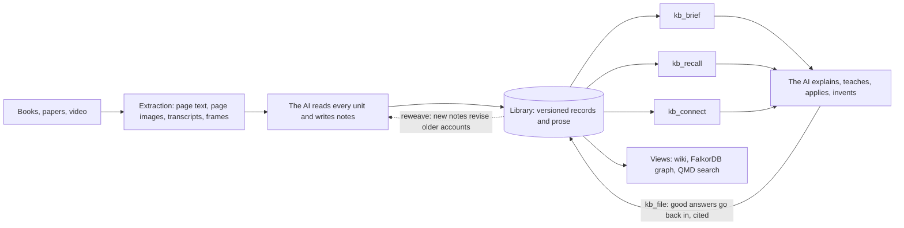

# Know Fu

<br>

<p align="center">
  
</p>

**Feed your AI books, papers and videos. Get back an expert you can question.**

Know Fu is a local research library for an AI coding agent such as Codex. You hand it a source. The agent reads every page, writes down what it learned as connected explanations, and goes back over older ideas the new source changes. The next session starts from all of that. It can explain a mechanism, teach it in order, apply it to a new case, weigh two authors who disagree, and suggest what to read next.

The model's weights never change. What grows is a library of understanding the AI can reach cheaply: mechanisms, procedures, concepts, worked examples, near misses, judgments about conflicts and open questions, each tied to the exact page it came from. The goal is the moment in *The Matrix* when Neo opens his eyes and says "I know kung fu". The method is careful reading and good bookkeeping.

[Set up with your AI](plugin/docs/setup-ai.md) · [Roadmap](docs/ROADMAP.md) · [North star](docs/NORTH_STAR.md) · [Architecture](plugin/docs/architecture.md) · [Lineage](plugin/docs/lineage.md) · [Change log](CHANGELOG.md)

## How it works



Taking a source in is a guided job. The agent registers the file, which is copied and never changed again, and converts it into units: page text from two PDF parsers, page images, transcript chunks, video frames. It reads every unit, then writes notes in Markdown: what the author claims, why it works, where it stops working, examples, and typed links to ideas already in the library (supports, challenges, qualifies, builds on). The engine turns cited pages into located passages and checks every quoted phrase against the source text. Then comes the step that makes knowledge compound. The engine lists every older account the new notes touch, and the agent revises it, reaffirms it, or leaves it flagged for review. Publication is one atomic release.

Using the library is three calls. `kb_brief` loads the orientation at the start of a session: each topic's primer, its most connected ideas, live disagreements and the questions worth answering next. `kb_recall` answers a question within a token budget. It returns the best explanations whole, the caveats and judgments that qualify them, and the pages they came from. `kb_connect` shows how two ideas are linked, hop by hop, with the reason recorded for each link. When an answer is worth keeping, `kb_file` publishes it back as a cited synthesis, and it is flagged for review if anything it relied on changes.

## Why it is built this way

A list of claims cannot teach. An expert knows why a claim holds, what it depends on and where it fails, so Know Fu stores explanations and the links between them, with claims as evidence underneath.

Disagreement is information. When two sources conflict, both accounts stay and a judgment records how they relate: different scope, a qualification, a provisional preference, or unresolved. Nothing is settled by which source is newer or louder. Where someone has assessed the accounts, recall sets both sides next to each other: the evidence level, the kind of support behind it, and how many independent sources stand behind each side. It still picks no winner.

Every claim can be checked. Records point to exact pages, quotes are verified against the extracted text, and the original file and page images stay available.

Answering should get cheaper as the library grows, not more expensive. On the three-paper acceptance library, `kb_recall` sends 6,000-12,000 tokens per answer where the older route sent 18,000-80,000. In a blind comparison on ten frozen questions, graders found its answers as good as the older route's: 10 of 10 passed, against 9 of 10. [Validation](docs/VALIDATION.md) has the details and the limits.

The canonical records own the meaning. The wiki, the FalkorDB graph and the QMD search index are generated views that can be deleted and rebuilt.

## Tools

| Tool | What it does |
|---|---|
| `kb_status` | Engine and library paths, current release, scope, job progress |
| `kb_brief` | Session-start orientation per topic |
| `kb_recall` | Budgeted answer briefing: explanations, caveats, sources, what else exists |
| `kb_connect` | Chains of links between two ideas, or what one idea reaches a few hops out |
| `kb_read` | Full accounts, topic catalogues, source units, guides and schemas |
| `kb_file` | Publish a worked answer as a cited synthesis |
| `kb_ingest`, `kb_job` | Register a source and move its ingestion job through the stages |
| `kb_write` | Author knowledge as Markdown notes (the preferred way to stage records) |
| `kb_propose`, `kb_change` | Stage raw proposals; preview or publish a job |
| `kb_maintain` | Reindex views, verify, export and restore, configure modules and bindings, meaning changes |
| `kb_lifecycle` | Archive, withdraw, reinstate or purge, by plan and authorization |
| `kb_evaluate` | Frozen, isolated capability evaluations through Codex |
| `kb_retrieve` | Older packet and progressive routes, kept for comparison |

## Getting started

Clone the repository, open it in your coding assistant and say:

> Read AGENTS.md and the AI-assisted setup guide. Help me set up Know Fu for my machine. Explain the supported options, recommend suitable storage locations, and ask about my preferences before initializing the library or installing services.

The setup guide separates what the system needs from choices one installation happened to make: where the library and runtime state live, how FalkorDB runs (managed WSL or a server you run yourself), native or WSL media tools, and API or local transcription. The [decision matrix](plugin/docs/setup-choices.md) lists the options.

## Status

The engine and the Codex adapter work on the development machine: Windows 11, Ubuntu WSL2, FalkorDB and QMD on the CPU. 131 automated tests: 128 pass, and 3 Python conversion tests skip where that runtime is absent. The pipeline has been exercised end to end on technical papers, including a three-source cumulative test. It has not yet ingested a long book or a full course with the new note format. A different machine needs its own dependency setup and checks. Docker deployment and local speech transcription are configurable but not tested end to end. [Validation](docs/VALIDATION.md) and [performance](docs/PERFORMANCE.md) record what has been shown and what hasn't.

## Code versus your data

This repository holds the engine and the plugin. Your library lives elsewhere.

| Area | What it holds |
|---|---|
| `src/` | The engine: storage, publication, ingestion jobs, recall, brief, connect, lifecycle |
| `contracts/schemas/` | The authoritative JSON schemas |
| `plugin/` | The Codex skill, its guides, setup docs and bundled schema copies |
| `scripts/` | Build, conversion, packaging and service helpers |
| `test/` | Automated checks with fictional fixtures |
| `docs/` | Intent, roadmap, validation, performance and maintenance |
| Your library directory | Sources, records and prose, jobs, audit history, generated views. Outside Git |
| Your state directory | Runtime configuration, the deletion ledger, model caches. Outside Git |
| Your graph storage | FalkorDB's own files, wherever its deployment keeps them |

Setup asks where these go. The machine-local `plugin/.mcp.json` is generated and never committed. Back up the library and its deletion ledger together: an old library backup without the matching ledger could bring back material you purged.

## Working on the code

Use the Node version pinned in `package.json` and install from the lockfile:

```sh
npm ci
npm run build
npm test
npm run format:check
npm run check:package
```

These build and test the engine. They do not install a graph server, a Python converter, model caches or a real library. The document-conversion tests skip when their Python runtime is missing. Record changes in [CHANGELOG.md](CHANGELOG.md) and reusable findings in [LESSONS.md](LESSONS.md); [maintenance](docs/MAINTENANCE.md) maps code changes to the docs they affect. Before committing, run `npm run check:release -- --staged` and review the staged files.

## Built from

TypeScript, JSON Schema with AJV, the MCP SDK, FalkorDB with its official client, QMD, Poppler, Docling and FFmpeg. The coding agent supplies all the reasoning. Speech APIs are optional and billed separately; there is no cloud database.

The ideas come from Karpathy's LLM Wiki, Ars Contexta's Reweave, rohitg00's LLM Wiki v2, discourse graphs and provenance practice, Scideator, HippoRAG's personalized PageRank, Vectorize's Hindsight, and [ste-bah](https://github.com/ste-bah)'s Memory Graph and Archon. Know Fu does not bundle Memory Graph or any of those systems. The [lineage](plugin/docs/lineage.md) says what came from where.

## Boundaries

Ingestion is not fine-tuning, and a passed evaluation is not general expertise. A link between two records is a recorded connection, not proof. Research memory and operational or project memory stay separate. Promotion tiers, several harnesses writing to one library, and `analogous_to` links are deferred decisions.

This is a public repository without an open-source license yet. Dependencies keep their own licenses. The README animation is third-party film imagery with its own [provenance note](assets/README.md). Private research, transcripts and credentials are not part of the code.
