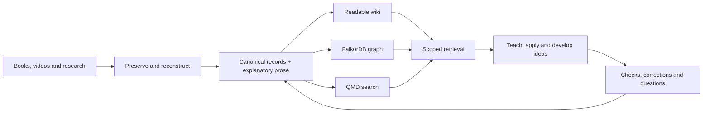

# Know Fu

<br>

<p align="center">
  
</p>

**Feed it research. Build knowledge your AI can explain, connect and put to work.**

Know Fu turns books, PDFs, videos and other specialized sources into a connected research library: preserved evidence, full explanations, qualified relationships, useful questions and a readable wiki. Your AI can return to that library to teach, compare interpretations, develop ideas and apply what it finds.

The ambition is the “I know kung fu” moment. The implementation is more inspectable: a persistent knowledge system, not a change to the model's weights or a promise of instant mastery.

[Set up with your AI](plugin/docs/setup-ai.md) · [Architecture](plugin/docs/architecture.md) · [Design lineage](plugin/docs/lineage.md) · [Setup choices](plugin/docs/setup-choices.md) · [Change log](CHANGELOG.md)

## What you get

- **Source-grounded ingestion.** Originals, locators, reading coverage and visual evidence remain available. Converting a file does not count as understanding it.
- **Connected explanations.** Mechanisms, assumptions, procedures, examples and exceptions survive alongside individual assertions.
- **Honest disagreement.** Source accounts, inference, hypotheses and judgments are distinguished. Conflicting knowledge can remain useful without being silently flattened into one answer.
- **A maintained wiki and graph.** Both derive from the same published meaning. New research can trigger revisions to affected explanations.
- **Useful retrieval.** Keyword/vector search, selected graph expansion and exact source reads supply context for teaching, application and invention.
- **Questions worth pursuing.** Missing evidence and grounded opportunities become explicit records for future investigation.
- **Local ownership.** Versioned JSON and Markdown carry the knowledge; graph and search views can be rebuilt.



## Start with your AI

Download or clone this repository, open it in your coding assistant, and say:

> Read AGENTS.md and the AI-assisted setup guide. Help me set up Know Fu for my machine. Explain the supported options, recommend suitable storage locations, and ask about my preferences before initializing the library or installing services.

Setup should fit your environment. The [decision matrix](plugin/docs/setup-choices.md) distinguishes architectural requirements from the first owner's preferences: WSL versus a separately managed FalkorDB service, storage paths, native/WSL media utilities, API versus local transcript preparation, and retrieval tradeoffs.

**Status:** local research engine and Codex adapter implemented; 54 automated tests pass on the development installation. The original deployment uses Windows, Ubuntu WSL2, FalkorDB and CPU QMD. A different machine still needs dependency provisioning and its own live checks. Docker deployment and an integrated local speech-decoding adapter are not claimed as end-to-end tested. See [validation](docs/VALIDATION.md) and the measured [performance boundaries](docs/PERFORMANCE.md).

## Repository versus your data

This repository includes the engine **and** the plugin. The `plugin/` folder by itself is only the adapter and its reference material.

| Area | Purpose |
|---|---|
| `src/` | Research coordinator, publication, retrieval and lifecycle code |
| `contracts/schemas/` | Authoritative JSON schemas |
| `plugin/` | Codex skill, book/video workflows, setup guides and bundled contract references |
| `scripts/` | Build, conversion, configuration and packaging helpers |
| `test/` | Automated checks and synthetic fixtures |
| `docs/` | Validation and maintenance guidance |
| Your selected library directory | Sources, canonical records/prose, jobs, audit and generated wiki; outside Git |
| Your selected state directory | Runtime configuration, independent deletion ledger and managed caches; outside Git |
| Your selected graph storage | Database-managed persistence, configured by the chosen server deployment |

Setup asks where these belong. The generated `plugin/.mcp.json` is machine-local and intentionally not committed. Protect the canonical corpus and its matching deletion ledger together; an old backup must not resurrect purged material.

## Components and influence

The implementation uses TypeScript, JSON Schema/AJV, the MCP SDK, regular FalkorDB with its official client, QMD, Docling/direct readers and FFmpeg. Codex supplies the reasoning. Hosted speech APIs are optional for media ingestion and billed separately; there is no required cloud-database subscription.

The design draws from Karpathy's LLM Wiki, Ars Contexta's Reweave, LLM Wiki v2, discourse/provenance research, Scideator and prior source-reconstruction workflows. **[ste-bah](https://github.com/ste-bah)**'s Memory Graph/FalkorDB work is a credited influence. **Know Fu does not bundle the Memory Graph application or require a fork of it.** [Full lineage and boundaries](plugin/docs/lineage.md).

## Working on the code

Use the pinned Node version in `package.json` and install from `package-lock.json`, then:

```sh
npm ci
npm run build
npm test
npm run format:check
npm run check:package
```

These build/test the engine; they do not provision a graph server, Python converter, model cache or a real library. Automated tests use synthetic sources; the optional document-conversion test reports a skip if its Python/BeautifulSoup runtime is absent. See the [setup guide](plugin/docs/setup.md) for runtime requirements and the [schema reference](plugin/contracts/README.md) for the data model.

Changes belong in [CHANGELOG.md](CHANGELOG.md); durable findings belong in [LESSONS.md](LESSONS.md). [Maintenance guidance](docs/MAINTENANCE.md) maps implementation changes to documentation. Before committing, run `npm run check:release -- --staged` and review the staged files.

## Boundaries

Knowledge ingestion is not fine-tuning. A graph edge is not proof; an evaluation pass is not universal expertise. Research and operational/project memory remain separate. Cross-harness shared writes, promotion tiers and mandatory cross-domain analogies are not enabled.

This is a public development repository. No open-source license for Know Fu has been selected. Dependency licenses and the [third-party README image](assets/README.md) have their own provenance; private research and credentials are not part of the code distribution.
