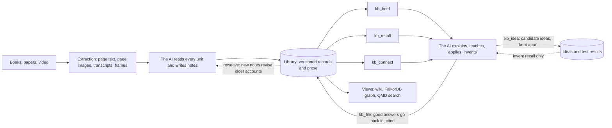

# Know Fu

<br>

<p align="center">
  
</p>

**Feed your AI books, papers and videos. Get back an expert you can question.**

Know Fu is a local research library for an AI coding agent like Codex. You hand it a source, and the agent actually reads it: every page, every figure that matters. It writes down what it learned as connected explanations, then goes back over the older ideas the new source changes. The next session starts from all of that. It can explain a mechanism, teach it in a sensible order, apply it to a case it's never seen, weigh two authors who disagree, and tell you what's worth reading next.

The model's weights never change. What grows is a library the AI can reach cheaply: mechanisms, procedures, concepts, worked examples, near misses, judgments about conflicts and open questions, each one tied to the exact page it came from. The goal is that moment in *The Matrix* when Neo opens his eyes and says "I know kung fu". The method is less cinematic: careful reading and very good bookkeeping.

[Set up with your AI](plugin/docs/setup-ai.md) · [Roadmap](docs/ROADMAP.md) · [North star](docs/NORTH_STAR.md) · [Architecture](plugin/docs/architecture.md) · [Lineage](plugin/docs/lineage.md) · [Change log](CHANGELOG.md)

## How it works



### Getting knowledge in

Taking in a source is a guided job, and the engine keeps the agent honest at each step. The file is copied once and never touched again. Then it's broken into units the agent can read: page text from two PDF parsers, page images, transcript chunks, video frames.

The agent reads every unit and writes notes in plain Markdown. A note says what the author claims, why it works, where it stops working, and gives an example. It links to ideas already in the library: this supports that, challenges that, qualifies that, builds on that. The engine turns the cited pages into located passages and checks every quoted phrase against the source text, so a misquote gets caught at the door.

Then comes the step that makes knowledge compound. The engine lists every older account the new notes touch, and the agent has to deal with each one: revise it, reaffirm it, or leave it flagged for review. A new source that quietly contradicts last month's explanation doesn't get to sit there unnoticed. Everything publishes together as one release.

### Getting knowledge out

Most of the time it's three calls:

- `kb_brief` at the start of a session. It loads each topic's primer, its most connected ideas, live disagreements and the questions worth answering next.
- `kb_recall` for each real question. It returns the best explanations whole, the caveats and judgments that qualify them, and the pages they came from, packed to a token budget.
- `kb_connect` when the question is how two ideas relate. It shows the chain of links between them, hop by hop, with the reason recorded for each link.

When an answer is worth keeping, `kb_file` publishes it back as a cited synthesis. If anything it relied on changes later, it gets flagged for review.

### Inventing

Invention is what the library is ultimately for. `kb_recall` with `purpose:"invent"` loads the accounts that match, each with a line saying what it does in words another field could recognize. Then it adds a slate: ideas already on file (failed ones say why), accounts in other topics that could bridge across (only when you ask for that), and loose ends nobody has connected yet.

New ideas go through `kb_idea` into their own lane, behind a set of walls. An idea rests on library accounts, but nothing can ever rest on an idea, and it never shows up when you're explaining, teaching or applying. Its status only moves when a result from your own tools comes in (a backtester, a mastering chain, a prototype), judged by a pass rule you declared before the run, with a count of how many variants were tried. Export hands the whole project, premises and results included, to those tools as JSON.

## Why it's built this way

A list of claims can't teach anybody. An expert knows why a claim holds, what it rests on and where it breaks, so Know Fu stores explanations and the links between them, with the claims underneath as evidence.

Disagreement is information, not noise. When two sources conflict, both accounts stay, and a judgment records how they relate: different scope, one qualifies the other, a provisional preference, or genuinely unresolved. Nothing gets settled by which source is newer or louder. Where someone has assessed the evidence, recall puts both sides next to each other: how strong the support is, what kind of support it is, and how many independent sources stand behind it. It still won't pick a winner for you.

Every claim can be checked. Records point to exact pages, quotes are verified against the extracted text, and the original file and page images stay available.

Answering should get cheaper as the library grows, not pricier. On the three-paper test library, `kb_recall` sends about 6,000-11,000 tokens per answer, where the older route sent 18,000-80,000. In a blind comparison on ten frozen questions, graders rated its answers as good as the older route's: 10 of 10 passed, against 9 of 10. (That test ran on slightly larger briefings than today's; an audit fix made the size accounting honest and trimmed them by 5-10%.) [Validation](docs/VALIDATION.md) has the details and the limits.

The canonical records own the meaning. The wiki, the FalkorDB graph and the QMD search index are generated views. Delete one and you lose nothing; rebuild it from the records.

## Tools

| Tool | What it does |
|---|---|
| `kb_status` | Engine and library paths, current release, scope, job progress |
| `kb_brief` | Session-start orientation per topic |
| `kb_recall` | A budgeted answer briefing: explanations, caveats, sources, and what else exists |
| `kb_connect` | Chains of links between two ideas, or what one idea reaches a few hops out |
| `kb_read` | Full accounts, topic catalogues, source units, guides and schemas |
| `kb_file` | Publish a worked answer as a cited synthesis |
| `kb_idea` | Keep candidate inventions in their own lane: propose, declare a pass rule, record results, export |
| `kb_ingest`, `kb_job` | Register a source and move its ingestion job through the stages |
| `kb_write` | Write knowledge as Markdown notes (the preferred way to stage records) |
| `kb_propose`, `kb_change` | Stage raw proposals; preview or publish a job |
| `kb_maintain` | Reindex views, verify, export and restore, configure modules and bindings, change meanings |
| `kb_lifecycle` | Archive, withdraw, reinstate or purge, by plan and authorization |
| `kb_evaluate` | Frozen, isolated capability evaluations through Codex |
| `kb_retrieve` | The older packet and progressive routes, kept around for comparison |

## Getting started

Clone the repository, open it in your coding assistant and say:

> Read AGENTS.md and the AI-assisted setup guide. Help me set up Know Fu for my machine. Explain the supported options, recommend suitable storage locations, and ask about my preferences before initializing the library or installing services.

The setup guide separates what the system actually needs from choices one installation happened to make: where the library and runtime state live, how FalkorDB runs (managed WSL or a server you run yourself), native or WSL media tools, and API or local transcription. The [decision matrix](plugin/docs/setup-choices.md) lays out the options.

## Where it's at

It works on the development machine: Windows 11, Ubuntu WSL2, FalkorDB and QMD on the CPU. There are 154 automated tests; 151 pass, and 3 Python conversion tests skip where that runtime isn't installed. The whole pipeline has run end to end on technical papers, including a three-source test where later papers had to revise earlier understanding. An independent audit on 5 October 2026 found twelve defects the tests had missed; all are fixed, and each now has a regression test.

What it hasn't done yet: ingest a long book or a full course with the new note format. A different machine needs its own dependency setup and checks, and Docker deployment and local speech transcription are configurable but untested end to end. [Validation](docs/VALIDATION.md) and [performance](docs/PERFORMANCE.md) keep score on what's been shown and what hasn't.

## Code versus your data

This repository holds the engine and the plugin. Your library lives somewhere else.

| Area | What it holds |
|---|---|
| `src/` | The engine: storage, publication, ingestion jobs, recall, brief, connect, lifecycle |
| `contracts/schemas/` | The authoritative JSON schemas |
| `plugin/` | The Codex skill, its guides, setup docs and bundled schema copies |
| `scripts/` | Build, conversion, packaging and service helpers |
| `test/` | Automated checks with fictional fixtures |
| `docs/` | Intent, roadmap, validation, performance and maintenance |
| Your library folder | Sources, records and prose, jobs, audit history, generated views. Outside Git |
| Your state folder | Runtime configuration, the deletion ledger, model caches. Outside Git |
| Your graph storage | FalkorDB's own files, wherever its deployment keeps them |

Setup asks where each of these should go. The machine-local `plugin/.mcp.json` is generated and never committed. One thing worth remembering: back up the library and its deletion ledger together. An old library backup without the matching ledger could bring back material you deliberately purged.

## Working on the code

Use the Node version pinned in `package.json` and install from the lockfile:

```sh
npm ci
npm run build
npm test
npm run format:check
npm run check:package
```

That builds and tests the engine. It doesn't install a graph server, a Python converter, model caches or a real library, and the document-conversion tests skip when Python is missing. Record changes in [CHANGELOG.md](CHANGELOG.md) and lessons worth keeping in [LESSONS.md](LESSONS.md). [Maintenance](docs/MAINTENANCE.md) maps each part of the code to the docs it affects. Before committing, run `npm run check:release -- --staged` and look over what you're about to push.

## Built from

TypeScript, JSON Schema with AJV, the MCP SDK, FalkorDB with its official client, QMD, Poppler, Docling and FFmpeg. The coding agent does all the reasoning. Speech APIs are optional and billed separately, and there's no cloud database.

The ideas come from Karpathy's LLM Wiki, Ars Contexta's Reweave, rohitg00's LLM Wiki v2, discourse graphs and provenance practice, Scideator, HippoRAG's personalized PageRank, Vectorize's Hindsight, and [ste-bah](https://github.com/ste-bah)'s Memory Graph and Archon. Know Fu doesn't bundle any of those systems. The [lineage](plugin/docs/lineage.md) says what came from where.

## Boundaries

Ingestion isn't fine-tuning, and passing an evaluation isn't general expertise. A link between two records is a recorded connection, not proof. Research memory and operational or project memory stay separate. Promotion tiers and several agents writing to one library are decisions for later. There's no `analogous_to` link, by choice: an analogy worth keeping is stored as an idea.

This is a public repository without an open-source license yet. Dependencies keep their own licenses. The README animation is third-party film imagery with its own [provenance note](assets/README.md). Private research, transcripts and credentials aren't part of the code.
