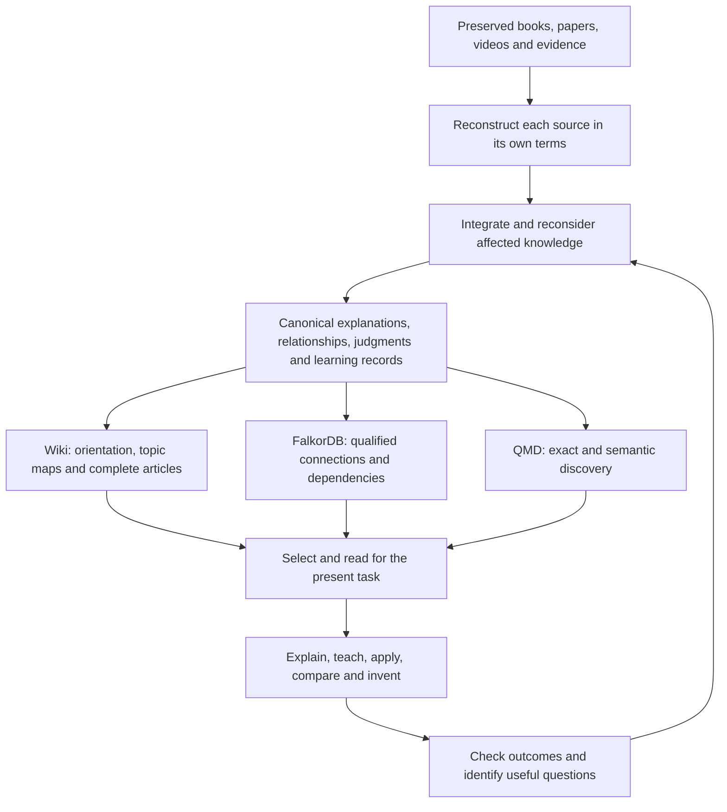

# Know Fu north star and implementation plan

Updated 5 October 2026: owner decisions on version 1.2.0 are recorded under "Decisions on 5 October 2026". This document restores the original product intent and the work needed to realise it more fully. The vision and established boundaries below come from the design discussions. The owner approved the complete implementation and GitHub push on 4 October: “Confirmed. Build it. And push to github.” The [implementation record](IMPLEMENTATION.md) tracks delivery; approval is not a claim that the changes are installed or validated.

## The experience we are building

**Feeding Know Fu a source should make the AI a more capable collaborator in that subject.** It should acquire a durable, connected understanding that a fresh session can use to explain difficult ideas, teach them, recognise when they apply, reconcile disagreements and develop useful new ideas, strategies and products.

The guiding image is the **“I know kung fu” moment**: give the system knowledge, then experience a meaningful increase in what it can do. The practical mechanism is a persistent research library plus capable reasoning and retrieval. The model's weights do not change. What compounds is the system's accessible understanding: explanations, distinctions, relationships, procedures, examples, judgments, useful questions and evidence from checked applications.

This was the intent before any particular graph database or wiki implementation was selected. The original concern was that huge lists of claims might fail to become coherent understanding. A claim can be useful, but an expert also understands why it holds, what it depends on, where it fails and how it connects to other knowledge.

Success should be visible in ordinary work. After ingesting relevant material, the AI should be better able to:

- Explain a mechanism in coherent prose, including the reasoning that makes it intelligible.
- Teach from prerequisites through examples and near misses, adapting to the learner's actual confusion.
- Apply knowledge to unfamiliar cases and recognise missing information or failed preconditions.
- Compare authors without erasing differences in meaning, evidence or scope.
- Combine compatible ideas into a hypothesis, strategy or product proposal, while identifying the untested steps.
- Identify the next question or source that would most improve an important decision.
- Revise earlier understanding when new evidence changes it, including dependent explanations and teaching material.

Research-backed software, courses, books, videos and other products are explicit intended uses. Diagnosing a failed application, critiquing a design and planning a discriminating experiment are natural extensions of those uses. These extensions are product opportunities, not permission to start projects or experiments automatically.

The user supplies sources, priorities and consequential judgments. The system should perform the reconstruction, organisation, reweaving, navigation and routine checking. The user should not have to become a database librarian or select a graph mode for every question.

## Commitments that should survive implementation changes

The selected architecture is **a machine-oriented research corpus with full explanations and a maintained wiki**. Its durable commitment is how knowledge is represented, connected, revised and used. Components can improve without forcing the research to be redone.

| Commitment | Practical consequence |
|---|---|
| Preserve the source and its meaning | Keep originals, exact locators, useful visual evidence, author-specific arguments and explicit extraction or interpretation gaps. Conversion alone does not establish understanding. |
| Store whole explanations alongside addressable claims | Keep mechanisms, procedures, reasoning, examples and exceptions intact at useful sizes. Graph structure must not reduce the library to isolated assertions. |
| Make understanding cumulative | New evidence should change affected existing accounts where warranted. Reweaving includes prose, examples, primers, judgments and questions, with a reason for each substantive revision. |
| Keep evidence, interpretation and invention distinguishable | Permit inference and creative reasoning from identified premises. A model-generated explanation, repeated derivative source or successful answer is not independent corroboration. |
| Handle disagreement as knowledge | Compare definitions, conditions, methods and evidence. Keep unresolved alternatives. Use justified, scoped supersession where replacement is warranted; never choose a winner merely by age, popularity or confidence. |
| Separate fidelity, support and applicability | A faithful account of an author's claim can still have weak empirical support or unknown relevance to the present case. Preserve those distinctions. |
| Make knowledge accessible at several levels | Orientation, topic summaries, complete explanations and original evidence should coexist. Summaries guide reading; detail remains available when it matters. |
| Evaluate capability | Check explanation, application, exceptions, synthesis and revision in fresh contexts. Record counts, links and successful indexing are infrastructure evidence. |
| Keep one owner of published meaning | Versioned canonical JSON and authored Markdown bodies are authoritative. Wiki, FalkorDB and QMD are rebuildable projections of a committed release. |
| Keep specialist research portable and scoped | One modular library with enforced module/source boundaries. Domain tags aid discovery. Operational and session memory remain separate. |

The current implementation choices remain the custom TypeScript coordinator and research adapter, FalkorDB, QMD and Codex reasoning. The Memory Graph application is a design influence rather than an installed dependency; retaining the custom adapter was explicitly accepted after comparison. This plan proposes no backend replacement.

The initial deployment uses local files and software without a required cloud-database subscription. API transcription is the existing preference for media. Research can inform general writing, teaching and product skills without requiring a research collection about those skills.

Knowledge-promotion tiers, shared cross-harness writes and operational/project memory remain deferred. `analogous_to` was excluded. Domain compatibility does not require automatic cross-domain analogy. Each book does not become a skill, and fixed page/link/probe quotas do not define a successful ingest.

“Every ingest makes it smarter” is the objective, not a promise of monotonic benchmark gains from arbitrary material. A redundant source may add little; a weak source may be qualified; a contradictory source may improve judgment by reducing false certainty. The useful question is what understanding or capability changed and whether unrelated knowledge remained sound.

## Decisions on 5 October 2026

The owner reviewed the 1.2.0 audit and rebuild and decided:

- Version 1.2.0 is the line going forward, rather than lifting parts of it into 1.1.0. Its `kb_recall` is the routine route for answering; packet and progressive retrieval remain available for comparison. This supersedes the 1.1.0 default named in the implementation plan below.
- A Claude Code adapter will be added once the owner judges the system finished. Shared writes from several harnesses remain deferred.

Since 1.2.0, multi-hop connection runs in process over the canonical records (spreading activation in recall, prerequisite chains for explain and teach), so answering no longer depends on the FalkorDB service. Whether FalkorDB stays as an optional view is an open decision in [ROADMAP.md](ROADMAP.md), together with how assessments should be used.

## One knowledge system with several ways to read it

The wiki is the readable organisation of the knowledge. The graph makes specific connections and their conditions addressable. Search finds useful entry points, including material the topic organisation misses. Codex chooses what to read and reasons with it. None of these components alone supplies expertise.

The proposed reading layers are:

| Layer | Contents | Why it exists |
|---|---|---|
| Library orientation | Available topics, short descriptions, scope and links to primers | Find the right area without loading the library |
| Topic map and primer | Essential distinctions, an explanatory overview, important tensions, relevant questions and links with summaries | Understand the shape of a topic and choose the next reading |
| Complete accounts | Mechanisms, procedures, syntheses, source-specific positions, worked examples and teaching sequences | Supply enough connected reasoning to understand and apply an idea |
| Supporting evidence | Exact passages, source pages/frames, calculations and evidence assessments | Resolve a consequential detail, ambiguity or challenge |

A concept can appear in several topic maps while retaining one canonical identity. Authors with incompatible definitions retain separate meanings. Topic maps should explain relationships and disagreements, rather than merely list files by type. The directory structure helps navigation; it is not the knowledge model.

These layers are alternative entry points. A broad teaching request may start with a primer. A precise table lookup should go straight to the relevant account or evidence. A compound question may begin at several points and bring the results together. A multi-level library does not require a fixed top-down journey.

## What the current system establishes and what remains missing

This is a 2 October 2026 snapshot of engine 1.0.2. Recheck it before implementation. The [validation record](VALIDATION.md), current schemas and runtime are the evidence for implemented behavior.

The foundation already supports preserved sources, authored prose, typed relationships, learning and question records, staged ingestion, reweaving guidance, publication, lifecycle controls and derived views. The accepted design has not disappeared from the schema or skill. The remaining issue is whether the consuming workflows consistently realise it.

The technical-paper pilot preserved and reconstructed a complete source, published 109 records and passed six application checks. Those answers used 55,026–74,786 input tokens each. They were fresh answer contexts receiving a fixed evidence packet, not agents choosing successive readings. The pilot did not establish graph superiority, efficient retrieval, cumulative multi-source expertise or unattended ingestion. [Pilot evidence and limits](VALIDATION.md#2026-10-01-representative-technical-paper-pilot)

The relevant gaps are concrete:

| Area | Observed implementation | Required improvement |
|---|---|---|
| Wiki navigation | Pages have summary frontmatter, but the index is a flat title/type/status list | Topic navigation that actually exposes summaries, primers and meaningful connections |
| Retrieval selection | Search seeds expand through graph neighbours, recursively cited inputs, qualifications and judgments | Separate navigable candidates and traceability from the content needed for this answer |
| Evaluation reading | The runner opens every selected record body before answering | An interactive reading evaluation, alongside the preserved fixed-packet baseline |
| Purpose handling | The purpose label and small ranking adjustments do not by themselves compose a teaching, comparison or invention route | Purpose-aware selection with observable reading decisions and task-specific completeness checks |
| Cumulative learning | Reweaving and rich records are supported, but the recent pilot concerns one source | Demonstrate that later ingests improve earlier understanding and preserve unrelated competence |

The code anchors are [projections.ts](../src/projections.ts), [retrieval.ts](../src/retrieval.ts), [evaluation.ts](../src/evaluation.ts), [jobs.ts](../src/jobs.ts) and the [retrieval workflow](../plugin/skills/know-fu/references/retrieval.md).

The main correction is therefore to finish the original knowledge-use architecture. Reducing repeated or irrelevant reading is one consequence. Token reduction must not become a substitute for understanding.

## Research informing this plan

These primary sources were reread on 2 October 2026. They contribute mechanisms and cautions; none proves that the proposed Know Fu changes will work. Repository branch links can change. The papers below identify the reviewed versions.

| Reference | Relevant finding | Proposed use and limit |
|---|---|---|
| [Karpathy LLM Wiki, Indexing and logging](https://gist.github.com/karpathy/442a6bf555914893e9891c11519de94f) | A maintained synthesis accumulates between queries; a linked index includes short summaries | Preserve the compiled understanding and provide useful navigation. Know Fu retains its canonical ownership model. |
| [nvk indexing](https://github.com/nvk/llm-wiki/blob/master/claude-plugin/skills/wiki-manager/references/indexing.md) and [Query Lite](https://github.com/nvk/llm-wiki/blob/master/claude-plugin/skills/wiki-manager/references/query-lite.md) | Master/category/article navigation and selective article/source reads are explicit | Borrow summary-led discovery. Keep release/hash freshness, direct lookup and coordinator ownership. Its indexing page's rebuild-on-read advice conflicts with Query Lite's read-only rule; neither becomes our publication protocol. |
| [Ars Contexta Reweave](https://github.com/agenticnotetaking/arscontexta/blob/main/skill-sources/reweave/SKILL.md) | Older notes can be substantively reconsidered using newer knowledge, including explanations, challenges and examples | Make the backward revision pass a normal part of ingestion. Do not import its entire framework, approval defaults or mechanical splitting rules. |
| [RAPTOR v1, retrieval methods](https://arxiv.org/html/2401.18059v1) | Retrieval can combine different abstraction levels. Its reported main method searches across levels after a comparison favoured that approach over fixed tree traversal | Index summaries and detailed accounts as entry points. Do not require root-first routing or assume a summary tree alone improves quality. |
| [GraphRAG DRIFT, Methodology](https://microsoft.github.io/graphrag/query/drift_search/) | Community reports orient follow-up local searches | Use an overview to formulate targeted subquestions for broad tasks. No wholesale GraphRAG installation or compulsory global pass. |
| [Scideator v1](https://arxiv.org/html/2409.14634v1) | Purpose, mechanism and evaluation facets support grounded idea exploration; novelty assessment needs comparison material | Use facets where informative and preserve premises, differences and a proposed test. Cross-domain combinations remain selective; retrieved novelty is not proof of global novelty. |
| [Progressive Disclosure ablation v1](https://arxiv.org/html/2607.04576v1) | It changes access structure while holding page bodies constant; outcomes vary with task breadth and tool conditions | Borrow the controlled comparison. Its failed preregistered grading-reliability gate and correctness/completeness sensitivity rule out treating the headline as universal no-loss evidence. |

The implementation choices below are our proposals drawn from these patterns, the accepted design and observed behavior. Existing component attribution remains in the [design lineage](../plugin/docs/lineage.md).

## Implementation plan

The phases sequence delivery of the complete architecture. They do not reopen the decision to build all its capabilities, or turn teaching, synthesis and invention into optional future add-ons. Each phase has a reviewable outcome and preserves the existing corpus.

### 1. Freeze the behavioral contract and comparison material

Keep this document as the project entry point for intent. Add representative questions for explanation, teaching, application, comparison, invention, broad synthesis and missing evidence. Identify decisive conditions from original sources and what a good answer must demonstrate. Include unfamiliar applications rather than paraphrases of stored examples.

Freeze the existing pilot release and preserve its fixed-packet results. Use some exposed cases for engineering regressions, then reserve separate cases for acceptance. Establish a small related-source sequence for the later cumulative-learning test: a foundational account, a complementary account and material that introduces a qualification or genuine disagreement. Source selection should fit the intended research use; a fictional sequence can test mechanics but cannot establish real expertise.

**Output:** a behavior-to-evidence matrix and frozen baseline. The user should be able to inspect what “more capable” means before implementation is judged.

### 2. Build summary-led navigation over the existing knowledge

In the projection builder, produce a compact library index, topic indexes and links to existing `learning` primers. Generate a machine-readable catalogue from the same release and record identities. Keep originals, relationship records and audit detail accessible without putting all of them in the main reading list.

Catalogue entries should carry an exact record reference, title, useful summary, form, domain/topic membership, lifecycle/freshness status, and links for opening the full account. Reuse `knowledge.summary`, concept definitions and existing learning/question fields where they provide a faithful compact account. If a record needs an authored navigation summary, add a small optional, versioned metadata field rather than generate a new LLM summary on every read. A missing summary remains explicit until authored; a title alone must not masquerade as a useful explanation.

Keep primers and topic syntheses canonical authored knowledge. Derive membership and link rendering from explicit references. A summary's dependencies remain traceable so later corrections mark it stale. Never build a new summary solely from an older summary if the original account or a material qualification needs checking.

Index summaries and full accounts for search with distinct result levels and one underlying identity. Avoid counting a summary and its body as separate corroboration. Scope-filter catalogue results, memberships and counts before exposure; a root index must not reveal inaccessible research. Large catalogues need pagination or topic lookup, not a mandatory whole-catalogue preload.

**Likely code:** `src/projections.ts`, `src/maintenance.ts`, search mapping and, only where needed, `contracts/schemas/record.schema.json` and proposal compilation.

**Done when:** a fresh session can find the correct topic, distinguish competing accounts and open the explanation; same-count edits invalidate stale navigation; out-of-scope titles and summaries do not leak.

### 3. Separate discovery, necessary context and provenance

Add a proposed progressive mode to `kb_retrieve` while preserving the existing packet mode for compatibility and comparison. A first response should present candidate accounts and a compact account of conditions, counterevidence, current judgments, freshness and next reads. It should not automatically paste every linked source body.

There are two distinct uses of `depends_on` to keep clear. A record's top-level dependency references preserve exact inputs and drive invalidation. A qualified relationship whose predicate is `depends_on` expresses a conceptual prerequisite. Neither means that every transitive body must be included in every answer. Preserve all references and existing withdrawal propagation while selecting reading by meaning.

Use three retrieval roles:

- **Orientation candidates:** enough information to decide whether an account matters.
- **Necessary reading:** the explanation and any prerequisite, qualification, challenge or judgment needed to avoid a materially misleading answer.
- **Traceable support:** exact supporting references available for verification and deeper reading.

Known qualifications of selected knowledge must be surfaced independently of search rank. Do not let the model suppress an inconvenient qualification merely to fit a budget. If a short statement cannot carry it safely, flag the full account as necessary reading. If required evidence is inaccessible, stale or too extensive for the remaining budget, disclose the resulting limit and avoid a settled answer.

Traverse typed relationships with their direction, scope and rationale. Prevent cycles and duplicate reads by exact reference and content identity. Search remains available across disconnected components. No fixed hop count can establish completeness, and structural proximity is not evidence of causation or valid transfer.

Budgets should cover actual rendered evidence and cumulative model input, including repeat context, metadata and tool calls. Track estimates separately from measured usage. Allow wider reading for broad questions; reserve room for important caveats and final reasoning. Return omitted candidates, outstanding necessary reads and truncation reasons explicitly, without revealing unauthorized content.

**Likely code:** `src/retrieval.ts`, `src/graph-projection.ts`, `src/api.ts`, `contracts/schemas/retrieval.schema.json` and generated types. Split discovery, qualification resolution and packet assembly into internal modules if that makes their contracts easier to test.

**Done when:** a narrow question avoids unrelated full-source reading, yet still finds a low-ranked exception, handles an unknown condition and preserves exact historical inputs and current lifecycle restrictions.

### 4. Make progressive reading available in normal Codex work

Extend the current read/retrieve interfaces to return topic navigation and open selected records. Keep existing full-record reads. If section reads are needed for long accounts, use stable release-bound section locators and hashes, carrying the record's material scope and warnings with each section. Do not use arbitrary character cuts as if they were complete reasoning units.

The retrieval workflow should guide Codex to establish the task, choose an entry point, inspect candidates, open the needed explanations, resolve consequential conditions and retrieve additional evidence where uncertainty remains. It should stop when the answer's material requirements are satisfied, or report what prevents completion. The reasoning stays with Codex; the coordinator enforces scope, identity, lifecycle and honest completeness status.

| User's task | Reading should resolve |
|---|---|
| Explain | What it means, why it works and the boundary that changes the explanation |
| Teach | Prerequisites, a coherent learning sequence, worked cases and likely misunderstandings |
| Apply | Decision criteria, necessary inputs, failed preconditions and what the conclusion permits |
| Compare | Each account's definition, scope, strongest relevant evidence and unresolved differences |
| Invent | Useful mechanisms, compatible assumptions, prior attempts, missing links and a discriminating test |
| Synthesize broadly | Coverage of the relevant topic branches, minority positions and exceptions |
| Investigate | What is known, the consequential gap and which next action could resolve it |

A topic summary can orient the answer; detailed assertions must be grounded in inspected accounts. Exact quotations, disputed calculations and ambiguous visual evidence need their primary evidence. Model knowledge may aid explanation or suggest a hypothesis, but must not be attributed to the library.

**Likely code and guidance:** `src/api.ts`, `src/mcp.ts`, `src/store.ts`, the Know Fu skill and retrieval reference. Proposed interface names and fields need versioned contracts before implementation; they are not current tool arguments.

**Done when:** a fresh installed-plugin session performs the reading sequence through the real tools, with a trace explaining selected and additional reads, and can answer accurately without a preassembled full packet.

### 5. Make each ingest revise the understanding that matters

Retain the existing reconstruct, integrate, discover, reweave, compile, check and publish workflow. Strengthen its substantive completion evidence rather than add more ceremonial stages.

Reconstruct the new source before comparing it with the corpus so existing beliefs do not rewrite the author. Use search, topic maps and qualified dependencies to identify affected knowledge. Reconsider the explanation, not just its links: a new source might narrow a procedure, expose incompatible definitions, supply a missing mechanism or change the most useful next question.

Update affected summaries, primers, learning records and questions together with their owning accounts. An affected account left unreassessed remains visibly pending. Dependents outside the authorized maintenance scope stay flagged for appropriate follow-up. Verify currentness before reuse; do not present a stale primer as settled orientation.

An ingestion report should explain what the system can now explain or apply better, what previous understanding changed, what remains unresolved and what was checked. A defensible “this source adds no new supported understanding” is valid. Counts and coverage receipts accompany the explanation rather than replace it.

**Likely code and guidance:** `src/jobs.ts`, `src/store.ts`, impact handling, ingestion/books/video references, and checks for navigation freshness. Existing extraction policy remains in force.

**Done when:** a second or third source changes a relevant earlier explanation and its teaching route, preserves the original author's account, exposes unresolved disagreement and leaves unrelated knowledge usable.

### 6. Exercise teaching, invention and the question backlog as core uses

Use existing learning, knowledge and question records before adding record types. Teaching should develop the reasoning and diagnose a likely misunderstanding. Application should preserve the steps that determine whether a method fits. Invention should combine mechanisms with an explanation of the proposed connection, its assumptions, the evidence behind each premise and the test that could disprove the new proposal.

Search by purpose, mechanism and constraints where helpful. Permit cross-domain exploration when the task warrants it and the scopes allow it. Record why the transfer might work and where it could fail. Returning no worthwhile combination is preferable to manufacturing novelty.

Prioritise questions by the decision they could change, dependencies they could unblock, uncertainty and cost of resolving them. Sparse graph connectivity alone does not establish a valuable gap. Keep a small reasoned set of next actions for the current task while retaining the wider backlog.

Reuse valuable checked explanations and applications through the normal authorized publication workflow. Keep speculative proposals marked as such. A good chat answer does not authorize an autonomous research campaign, and a generated exercise is not empirical validation of its premise.

**Done when:** fresh sessions can teach a difficult distinction, apply it to a new case, propose a defensible extension and identify a worthwhile missing test using the same corpus. Output quality and correctness matter more than how many learning or idea records exist.

### 7. Evaluate the system we intend to use

Extend the evaluator with a constrained interactive mode. It must expose only the pinned corpus and permitted read-only retrieval tools, while denying unrelated files, network sources and hidden answer material. Recheck current withdrawal, deletion and permissions even during a pinned-release run. Verify isolation before counting results.

Record selected summaries, full/section/source reads, graph expansions, unmet reading requirements, actual input/output usage, repeated context, latency and answer citations. Keep the fixed-packet evaluator as a separately named baseline; do not silently relabel old results as agentic retrieval.

Run two comparisons for different questions:

1. **Access-structure comparison:** hold canonical page bodies and release constant; compare the existing packet route with progressive routes, with and without optional graph exploration. Preserve material qualification checks in every route. This isolates the reading policy.
2. **Cumulative-knowledge comparison:** compare capability before and after the related-source sequence, then against original-passages-only and no-library conditions where useful. This tests whether synthesis and reweaving add usable understanding. Also repeat unaffected tasks to check retention.

Use realistic operating budgets and separately report matched-budget comparisons. Count the whole reading trajectory, not only the final prompt. Repeat important cases to expose variability. Do not treat paraphrases of one case as independent evidence.

Assess correctness, completeness, conditions, citation support, coherent teaching, useful synthesis, justified inference and recognition of gaps separately. Have a source-grounded reviewer inspect disputed grades, especially calculations and visual evidence. A grader's instruction is not authority to rewrite the corpus; the earlier validation experience demonstrated that failure directly.

The adoption criterion is preserved or improved substantive quality with useful reading efficiency on the intended tasks, plus all lifecycle/scope regressions passing. Broad synthesis may legitimately require more reading. No aggregate score may conceal a lost decisive condition or completeness failure. Set task-specific thresholds before comparing results; do not invent a universal percentage of token savings as a product requirement.

**Likely code:** `src/evaluation.ts`, evaluation contracts and isolated runner tests. Keep exposed repairs, held-out cases and human/coordinator review distinguishable.

### 8. Roll out without rewriting the research

Ship the new navigation and progressive route as an additive, explicitly versioned capability. Existing canonical records and the old route remain readable. Rebuild derived views from the pinned corpus; review any authored navigation additions as normal revisions. Preserve source IDs, locators, reading receipts, disagreements and lifecycle history. A search-index rebuild is not a new source ingestion.

After the comparisons and fresh-session checks, make the successful reading policy the default and update the installed plugin. Verify packaged contracts, real MCP behavior, source-image access, projection freshness and interruption/resume behavior. Continue with a supervised migration of a coherent research slice, following the preservation checks already established. Large historical migrations and any change of production binding remain their own authorized work.

Keep future retrieval algorithms behind the same ownership and evidence contracts. A later backend or ranking improvement should not require reconstructing every book.

## How future work should stay aligned

Read this document before proposing material architecture, ingestion, retrieval or evaluation changes. Consult the specific code and workflow references needed for the task, rather than reloading all historical design discussion.

For each material change, explain which capability it improves, what understanding might be lost, how the source/evidence boundary is preserved and what observation would show it worked. Treat the established vision, current implementation facts and unaccepted proposals as separate things. A compaction summary, old assistant recommendation or convenient library default cannot silently replace an explicit user decision.

When the user changes a decision, update its reason here and the affected technical documentation. Preserve historical evidence without maintaining multiple competing current specifications. This document governs product intent; schemas/runtime describe current mechanics; [VALIDATION.md](VALIDATION.md) records what has actually been demonstrated. New user direction can revise any project decision.

The approved 1.1.0 build was delivered with installed-tool checks and controlled application evidence; [IMPLEMENTATION.md](IMPLEMENTATION.md) records that handover. Version 1.2.0 followed on 5 October 2026 and is the line the owner chose to continue (below). Its budgeted recall replaced the packet as the routine route after a blind comparison found equal answer quality at about one-eighth of the material. [ROADMAP.md](ROADMAP.md) holds the current task list and open decisions, and [VALIDATION.md](VALIDATION.md) the outcomes and limits. Production migration and wider independent capability testing remain separate work. Preserve the earlier pilots and distinguish implemented mechanisms from demonstrated capability.
