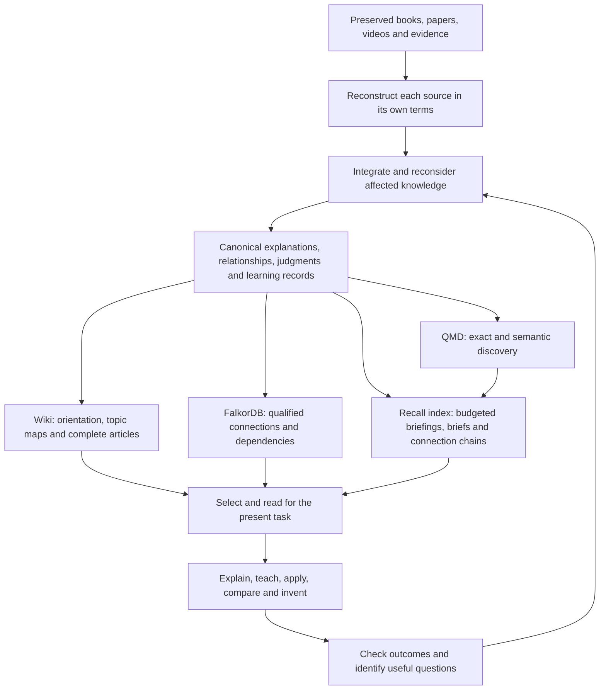

# Know Fu north star and implementation plan

This is the "why" document. It holds what Know Fu is for and every decision the owner has made about it. The vision and its boundaries come from the original design conversations. The owner approved the full 1.1.0 build and a GitHub push on 4 October 2026 ("Confirmed. Build it. And push to github."), and the [implementation record](IMPLEMENTATION.md) tracks how that went. Approval on its own doesn't mean anything is installed or proven. The decisions from 5 October 2026 are further down, under their own heading.

## The experience we're after

Feeding Know Fu a source should make the AI a better collaborator in that subject. Not a better search box: a collaborator that has actually absorbed the material and can explain hard ideas, teach them, spot when they apply, reconcile disagreements, and help build new ideas, strategies and products on top of them.

The guiding image is the "I know kung fu" moment. You give the system knowledge, and you feel a real jump in what it can do. The model's weights don't change, so the jump has to come from somewhere else: a persistent research library, read well and retrieved well. That library holds explanations, distinctions, relationships, procedures, examples, judgments, useful questions, and evidence from applications that were actually checked.

This intent came first, before any graph database or wiki was chosen. The original worry was simple. Huge lists of claims might never add up to understanding. A claim is useful, but an expert also knows why it holds, what it rests on, where it breaks and how it connects to everything else.

So success should show up in ordinary work. After ingesting relevant material, the AI should get better at:

- Explaining a mechanism in coherent prose, including the reasoning that makes it click.
- Teaching from prerequisites through examples and near misses, adapting to where the learner is actually stuck.
- Applying knowledge to unfamiliar cases, and noticing missing information or a failed precondition.
- Comparing authors without flattening real differences in meaning, evidence or scope.
- Combining compatible ideas into a hypothesis, strategy or product proposal, and naming the steps nobody has tested.
- Finding the next question or source that would most improve an important decision.
- Revising earlier understanding when new evidence changes it, including the explanations and teaching material that depend on it.

Research-backed software, courses, books, videos and other products are all intended uses. Diagnosing a failed application, critiquing a design and planning a discriminating experiment follow naturally. They're opportunities, though, not permission to start projects or experiments on the system's own initiative.

The division of labor matters. You supply the sources, the priorities and the judgment calls that carry consequences. The system does the reconstruction, the organizing, the reweaving, the navigation and the routine checking. You should never have to act as a database librarian, or pick a graph mode before asking a question.

## Commitments that outlast any implementation

The chosen architecture is a machine-oriented research library with full explanations and a maintained wiki. The parts can change. What has to survive is how knowledge is represented, connected, revised and used, so that a better component never forces the research to be redone.

| Commitment | What it means in practice |
|---|---|
| Preserve the source and its meaning | Keep originals, exact locators, useful visual evidence, each author's own argument, and explicit gaps in extraction or interpretation. Converting a file isn't understanding it |
| Store whole explanations beside addressable claims | Keep mechanisms, procedures, reasoning, examples and exceptions intact at useful sizes. Graph structure must never reduce the library to isolated assertions |
| Make understanding cumulative | New evidence changes the existing accounts it affects, where that's warranted. Reweaving covers prose, examples, primers, judgments and questions, with a reason for each real revision |
| Keep evidence, interpretation and invention apart | Inference and creative reasoning from named premises are welcome. A model-written explanation, a repeated derivative source or a successful answer isn't independent corroboration |
| Treat disagreement as knowledge | Compare definitions, conditions, methods and evidence. Keep unresolved alternatives. Supersede only with a reason and a scope, and never pick a winner by age, popularity or confidence |
| Keep fidelity, support and applicability separate | A faithful account of an author's claim can still rest on weak evidence, or have unknown relevance to the case in front of you |
| Make knowledge reachable at several levels | Orientation, topic summaries, complete explanations and original evidence all coexist. Summaries guide reading; the detail stays there for when it matters |
| Evaluate capability, not plumbing | Check explanation, application, exceptions, synthesis and revision in fresh contexts. Record counts, link counts and a healthy index are infrastructure evidence, not capability |
| Keep one owner of published meaning | Versioned canonical JSON and authored Markdown bodies are the authority. The wiki, FalkorDB and QMD are rebuildable views of a published release |
| Keep specialist research portable and scoped | One modular library with enforced module and source boundaries. Domain tags help discovery. Operational and session memory stay separate |

Today's implementation is a custom TypeScript engine and research adapter, FalkorDB, QMD and Codex doing the reasoning. Memory Graph is a design influence, not an installed dependency; keeping a custom adapter was a deliberate choice after comparing the two.

The first deployment runs on local files and software, with no cloud database to pay for. Media transcription goes through APIs by preference. Research can feed general writing, teaching and product skills without needing a research collection about those skills.

A few things are deliberately parked: promotion tiers for knowledge, several agents writing to one library, and operational or project memory. `analogous_to` links were excluded outright, and having compatible domains doesn't mean the system should draw cross-domain analogies on its own. A book doesn't become a skill. And no fixed quota of pages, links or probes defines a successful ingest.

"Every ingest makes it smarter" is the objective, not a promise that any material raises a benchmark score. A redundant source may add very little. A weak source may end up qualified. A contradicting source can improve judgment just by removing false certainty. The useful question after an ingest is what understanding or capability changed, and whether everything unrelated stayed sound.

## Decisions on 5 October 2026

The owner reviewed the 1.2.0 audit and rebuild and decided two things:

- 1.2.0 is the line going forward, rather than lifting pieces of it into 1.1.0. `kb_recall` becomes the routine way to answer. Packet and progressive retrieval stay callable for comparison. This replaces the 1.1.0 default named in the plan below.
- A Claude Code adapter comes once the owner judges the system finished. Several agents writing to one library is still a separate, later question.

Later that day, after reading the audit report, three more:

- Build `kb_connect` now. It answers "how does A connect to B?" with explicit chains of links, and "what does A reach?" when there's no target. Connecting distant ideas is what drew the owner to this project in the first place, so it deserved its own tool.
- Keep FalkorDB for now, as an optional view. Answering doesn't need it, because recall's spreading activation and `kb_connect` both run in process over the release. It stays useful for browsing the graph visually and for ad hoc Cypher questions.
- Make assessments earn their place. Agents assess evidence on claims a decision could rest on, give a one-line reason, and leave guesses blank. Recall shows the levels on each account and sets both sides of a conflict next to each other. Levels never rank one side over the other. The owner also asked for anything better in other tools to be adopted, and a review of eight of them added one thing: each evidence level names its basis, and the engine checks that basis against the number of independent source families (see the [design lineage](../plugin/docs/lineage.md)).

## Decisions on 6 October 2026

The owner sharpened the priority: "Ultimately, I want it to be an invention engine." Inventing new strategies, products, processes and ideas from what the library holds now ranks first. Explaining and teaching rank a close second, and they matter partly because they make invention better. The owner's own examples: new trading strategies or software that invents strategies, a mastering workflow or app from audio books and videos, explainer videos for nuanced skills, inventions from science books, products that combine fields nobody would put together, and the library naming its own gaps.

A research round on how people and machines invent followed (summarized in the [design lineage](../plugin/docs/lineage.md)). It found the knowledge layer described above already fits invention, and that the layer for running invention was half-built. The owner approved one change straight away: restore functional facets in `kb_write`, after measuring their token cost, so every new mechanism and procedure says what it does in words another field could match. Later the same day the owner decided most of the rest, and all of it was built on the `claude/know-fu-invention` branch:

- Ideas get their own lane, with walls. An idea never reaches explain, teach or apply recall, can never be evidence for knowledge, can't parent another idea until it's been tested, and changes status only with a real test result. A changed premise flags it. Ideas export, so the owner's own tools can hold the project.
- `invent` becomes a real preset, and all seven presets stay. Borrowing from other fields is opt-in per call, because some inventions want it and some don't.
- Test results come from the owner's own tools. Know Fu records them (tool, version, data window, a pass rule declared before the run, outcome, trial count) and never runs backtests or keeps a registry of evaluators.
- Gap-finding stays a ranked list of open questions. Recorded questions lead, and a few cheap signals computed from the library's shape suggest more. Sources' own open problems become question notes. The catalog comparison was dropped.
- The guides gain counter-framing, generating past the obvious, separate originality and feasibility ratings, and teaching by comparison.
- Procedures carry decision points, shown as a tree. The owner's reason: "I need to see the decision tree."

The owner also settled what "lineage" means for them: which concept leads to which, so books read in the wrong order still end up in the right order. That's the job `depends_on` links, "Foundations first" and reweaving already do, and the ingestion guide now says what to record when an advanced book arrives before its foundations. How to store an accepted analogy is still open.

## One knowledge system, several ways in

Each part has one job. The wiki is the readable organization of the knowledge. The graph makes specific connections and their conditions addressable. Search finds entry points, including things the topic structure misses. Since 1.2.0, the recall index does most routine answering straight from the canonical records. Codex decides what to read and does the reasoning. No single part supplies the expertise; it comes from all of them working together.

The reading layers look like this:

| Layer | What's in it | Why it exists |
|---|---|---|
| Library orientation | The topics available, short descriptions, scope, links to primers | Find the right area without loading the whole library |
| Topic map and primer | Essential distinctions, an overview, the important tensions, relevant questions, links with summaries | See the shape of a topic and choose what to read next |
| Complete accounts | Mechanisms, procedures, syntheses, per-source positions, worked examples, teaching sequences | Supply enough connected reasoning to understand and apply an idea |
| Supporting evidence | Exact passages, source pages and frames, calculations, evidence assessments | Settle a detail, an ambiguity or a challenge that matters |

A concept can show up in several topic maps under one identity. Authors with incompatible definitions keep separate meanings. A topic map should explain relationships and disagreements, not just list files by type. The folder structure helps you find things; it isn't the knowledge model.

These layers are entry points, not a staircase. A broad teaching request might start with a primer. A precise table lookup should go straight to the account or the evidence. A compound question might start in several places at once and bring the results together.

## Snapshot: engine 1.0.2 on 2 October 2026

This section is a dated photo of where things stood before the 1.1.0 plan below was built. For current behavior, look at the [validation record](VALIDATION.md), the schemas and the code.

The foundation was already solid: preserved sources, authored prose, typed relationships, learning and question records, staged ingestion, reweaving guidance, publication, lifecycle controls and derived views. The design hadn't gone anywhere; it was all still in the schema and the skill. The real question was whether the workflows that *use* knowledge actually delivered on it.

The technical-paper pilot showed both sides of that. It preserved and reconstructed a complete source, published 109 records and passed six application checks. But each answer cost 55,026 to 74,786 input tokens, because each one was a fresh context handed a fixed evidence packet rather than an agent choosing what to read. The pilot didn't show that the graph helps, that retrieval is efficient, that expertise builds up across sources, or that ingestion can run unattended. [Pilot evidence and limits](VALIDATION.md#2026-10-01-representative-technical-paper-pilot)

The gaps were concrete:

| Area | What the code did | What it needed |
|---|---|---|
| Wiki navigation | Pages had summary frontmatter, but the index was a flat list of titles, types and statuses | Topic navigation that shows summaries, primers and meaningful connections |
| Retrieval selection | Search seeds expanded through graph neighbors, recursively cited inputs, qualifications and judgments | Keep candidates and traceability apart from the content this answer actually needs |
| Evaluation reading | The runner opened every selected record body before answering | An interactive reading evaluation, beside the preserved fixed-packet baseline |
| Purpose handling | A purpose label and small ranking nudges didn't add up to a teaching, comparison or invention route | Purpose-aware selection, with visible reading decisions and completeness checks per task |
| Cumulative learning | Reweaving and rich records were supported, but the pilot covered one source | Show that later ingests improve earlier understanding and keep unrelated competence intact |

The code at the center of it was [projections.ts](../src/projections.ts), [retrieval.ts](../src/retrieval.ts), [evaluation.ts](../src/evaluation.ts), [jobs.ts](../src/jobs.ts) and the [retrieval guide](../plugin/skills/know-fu/references/retrieval.md).

The fix was to finish the original architecture for using knowledge. Reading less irrelevant material follows from that. Cutting tokens must never become a stand-in for understanding.

## Research behind the 1.1.0 plan

These primary sources were reread on 2 October 2026. They contributed mechanisms and cautions; none of them proves the Know Fu changes work. Branch links can move, so the papers name the versions reviewed. The sources behind 1.2.0 are in the [design lineage](../plugin/docs/lineage.md).

| Reference | What it found | How Know Fu uses it, and the limit |
|---|---|---|
| [Karpathy LLM Wiki, Indexing and logging](https://gist.github.com/karpathy/442a6bf555914893e9891c11519de94f) | A maintained synthesis builds up between queries; a linked index carries short summaries | Keep the compiled understanding and give it useful navigation. Know Fu keeps its own ownership model |
| [nvk indexing](https://github.com/nvk/llm-wiki/blob/master/claude-plugin/skills/wiki-manager/references/indexing.md) and [Query Lite](https://github.com/nvk/llm-wiki/blob/master/claude-plugin/skills/wiki-manager/references/query-lite.md) | Master, category and article navigation, with selective reads of articles and sources | Borrow summary-led discovery. Keep release and hash freshness, direct lookup and engine ownership. Its indexing page's rebuild-on-read advice contradicts Query Lite's read-only rule, and neither becomes Know Fu's publication protocol |
| [Ars Contexta Reweave](https://github.com/agenticnotetaking/arscontexta/blob/main/skill-sources/reweave/SKILL.md) | Older notes can be reconsidered in light of newer knowledge, including explanations, challenges and examples | Make the backward revision pass a normal part of ingestion. Leave the framework, its approval defaults and its mechanical splitting rules behind |
| [RAPTOR v1, retrieval methods](https://arxiv.org/html/2401.18059v1) | Retrieval can mix abstraction levels; searching across levels beat fixed tree traversal in their comparison | Index summaries and detailed accounts as entry points. Don't force root-first routing, or assume a summary tree improves quality by itself |
| [GraphRAG DRIFT, Methodology](https://microsoft.github.io/graphrag/query/drift_search/) | Community reports steer follow-up local searches | Use an overview to frame targeted subquestions for broad tasks. No GraphRAG install and no compulsory global pass |
| [Scideator v1](https://arxiv.org/html/2409.14634v1) | Purpose, mechanism and evaluation facets support grounded idea exploration; judging novelty needs comparison material | Use facets where they help, and keep premises, differences and a proposed test. Cross-domain combinations stay selective; "nothing similar retrieved" isn't proof of novelty |
| [Progressive Disclosure ablation v1](https://arxiv.org/html/2607.04576v1) | Changing access structure while holding page bodies constant; results vary with task breadth and tool conditions | Borrow the controlled comparison. Its failed preregistered grading-reliability gate, and its sensitivity to how correctness and completeness are scored, rule out reading the headline as universal no-loss evidence |

## The 1.1.0 implementation plan

This plan was approved on 4 October 2026 and delivered; [IMPLEMENTATION.md](IMPLEMENTATION.md) has the story. Version 1.2.0 later replaced its default reading route. It stays here because its rules about qualifications, scope, budgets, reweaving and evaluation still apply to every read path, including the new ones.

The phases ordered the delivery of the whole architecture. They didn't turn teaching, synthesis or invention into optional extras, and each phase had a reviewable outcome and left the existing library intact.

### 1. Freeze the behavioral contract and comparison material

Keep this document as the entry point for intent. Write representative questions for explanation, teaching, application, comparison, invention, broad synthesis and missing evidence. Find the decisive conditions in the original sources and what a good answer has to show. Include unfamiliar applications, not paraphrases of stored examples.

Freeze the pilot release and its fixed-packet results. Use some exposed cases as engineering regressions and keep separate ones for acceptance. Set up a short sequence of related sources for the cumulative-learning test: a foundational account, a complementary one, and material that adds a qualification or a real disagreement. Pick sources that fit the intended research use. A fictional sequence can test the mechanics but can't show real expertise.

Output: a matrix from behavior to evidence, and a frozen baseline, so the owner can see what "more capable" means before anything is judged.

### 2. Build summary-led navigation over the existing knowledge

In the projection builder, produce a compact library index, topic indexes and links to existing `learning` primers. Generate a machine-readable catalogue from the same release and record identities. Keep originals, relationship records and audit detail reachable without crowding them into the main reading list.

A catalogue entry carries an exact record reference, title, useful summary, form, domain and topic membership, lifecycle and freshness status, and links to open the full account. Reuse `knowledge.summary`, concept definitions and existing learning and question fields where they give a faithful short account. Where a record needs an authored navigation summary, add a small optional, versioned metadata field instead of generating a fresh LLM summary on every read. A missing summary stays visibly missing until someone writes it. A title never passes for an explanation.

Primers and topic syntheses stay canonical authored knowledge. Membership and link rendering come from explicit references. A summary's dependencies stay traceable, so a later correction marks it stale. Never build a summary only from an older summary when the original account or a material qualification needs checking.

Index summaries and full accounts for search as distinct result levels with one identity underneath, and never count a summary and its body as two sources. Filter catalogue results, memberships and counts by scope before showing them; a root index must not leak research the reader can't access. Large catalogues need pagination or topic lookup, not a whole-catalogue preload.

Likely code: `src/projections.ts`, `src/maintenance.ts`, the search mapping, and only if needed `contracts/schemas/record.schema.json` and proposal compilation.

Done when a fresh session can find the right topic, tell competing accounts apart and open the explanation; edits that keep record counts the same still invalidate stale navigation; and out-of-scope titles and summaries don't leak.

### 3. Separate discovery, necessary context and provenance

Add a progressive mode to `kb_retrieve` and keep the packet mode for compatibility and comparison. A first response offers candidate accounts with a short account of conditions, counterevidence, current judgments, freshness and next reads. It doesn't paste every linked source body.

`depends_on` has two jobs, and they need keeping apart. A record's top-level dependency references preserve its exact inputs and drive invalidation. A relationship whose predicate is `depends_on` states a conceptual prerequisite. Neither means every transitive body belongs in every answer. Keep all the references and the existing withdrawal propagation, and choose what to read by meaning.

Retrieval plays three roles:

| Role | What it gives |
|---|---|
| Orientation candidates | Enough to decide whether an account matters |
| Necessary reading | The explanation, plus any prerequisite, qualification, challenge or judgment needed to avoid a materially misleading answer |
| Traceable support | Exact supporting references for checking and deeper reading |

Known qualifications of selected knowledge surface regardless of search rank. The model doesn't get to drop an inconvenient qualification to fit a budget. If a short statement can't carry it safely, flag the full account as necessary reading. If required evidence is inaccessible, stale or too long for what's left of the budget, say so and don't present a settled answer.

Follow typed relationships with their direction, scope and rationale. Prevent cycles and duplicate reads by exact reference and content identity. Search stays available across disconnected parts. No fixed hop count proves completeness, and being close together in the graph is not evidence of causation or valid transfer.

Budgets cover the evidence actually rendered and the cumulative model input, including repeated context, metadata and tool calls. Track estimates separately from measured usage. Allow wider reading for broad questions, and keep room for important caveats and the final reasoning. Return omitted candidates, outstanding necessary reads and the reasons for any cut, without revealing unauthorized content.

Likely code: `src/retrieval.ts`, `src/graph-projection.ts`, `src/api.ts`, `contracts/schemas/retrieval.schema.json` and generated types. Split discovery, qualification resolution and packet assembly into internal modules if that makes their contracts easier to test.

Done when a narrow question avoids reading unrelated full sources, still finds a low-ranked exception, handles an unknown condition, and keeps exact historical inputs and current lifecycle restrictions.

### 4. Make progressive reading part of normal Codex work

Extend the read and retrieve interfaces to return topic navigation and open selected records, and keep full-record reads. If long accounts need section reads, use stable section locators and hashes bound to the release, and carry the record's material scope and warnings with every section. An arbitrary character cut is never a complete unit of reasoning.

The retrieval guide walks Codex through it: establish the task, choose an entry point, inspect candidates, open the explanations it needs, settle the conditions that matter, and fetch more evidence where uncertainty remains. It stops when the answer's requirements are met, or reports what blocks it. Codex does the reasoning; the engine enforces scope, identity, lifecycle and an honest completeness status.

| The task | Reading should settle |
|---|---|
| Explain | What it means, why it works, and the boundary that changes the explanation |
| Teach | Prerequisites, a coherent sequence, worked cases and likely misunderstandings |
| Apply | Decision criteria, necessary inputs, failed preconditions and what the conclusion allows |
| Compare | Each account's definition, scope, strongest relevant evidence and unresolved differences |
| Invent | Useful mechanisms, compatible assumptions, prior attempts, missing links and a discriminating test |
| Synthesize broadly | Coverage of the relevant branches, minority positions and exceptions |
| Investigate | What's known, the gap that matters, and which next action could close it |

A topic summary can orient an answer, but detailed claims have to rest on accounts that were actually opened. Exact quotations, disputed calculations and ambiguous visuals need their primary evidence. Model knowledge can help explain or suggest a hypothesis, but it never gets attributed to the library.

Likely code and guidance: `src/api.ts`, `src/mcp.ts`, `src/store.ts`, the Know Fu skill and the retrieval guide. New interface names and fields need versioned contracts first.

Done when a fresh installed-plugin session runs the reading sequence through the real tools, with a trace of what it chose to read and why, and answers accurately without a preassembled full packet.

### 5. Make each ingest revise the understanding that matters

Keep the reconstruct, integrate, discover, reweave, compile, check and publish workflow. Strengthen the evidence that each stage was really done, rather than adding ceremonial stages.

Reconstruct the new source before comparing it with the library, so existing beliefs don't rewrite the author. Use search, topic maps and qualified dependencies to find what it affects. Then reconsider the explanation, not just its links: a new source might narrow a procedure, expose incompatible definitions, supply a missing mechanism, or change the most useful next question.

Update affected summaries, primers, learning records and questions together with the accounts they belong to. An affected account left unreassessed stays visibly pending. Dependents outside the authorized maintenance scope stay flagged for follow-up. Check that something is current before reusing it, and never present a stale primer as settled orientation.

An ingestion report says what the system can now explain or apply better, what earlier understanding changed, what's still unresolved and what was checked. "This source adds no new supported understanding" is a perfectly good result when it's defensible. Counts and coverage receipts sit alongside the explanation; they don't replace it.

Likely code and guidance: `src/jobs.ts`, `src/store.ts`, impact handling, the ingestion, books and video guides, and freshness checks for navigation. The existing extraction policy stays in force.

Done when a second or third source changes a relevant earlier explanation and its teaching route, keeps the original author's account, exposes unresolved disagreement, and leaves unrelated knowledge usable.

### 6. Treat teaching, invention and the question backlog as core uses

Use existing learning, knowledge and question records before inventing new record types. Teaching develops the reasoning and diagnoses a likely misunderstanding. Application keeps the steps that decide whether a method fits. Invention combines mechanisms with an explanation of the proposed connection, its assumptions, the evidence behind each premise, and the test that could kill it.

Search by purpose, mechanism and constraints where it helps. Allow cross-domain exploration when the task warrants it and the scopes allow it, and record why the transfer might work and where it could fail. Finding no worthwhile combination beats manufacturing novelty.

Rank questions by the decision they could change, the dependencies they could unblock, the uncertainty, and the cost of answering them. A sparse corner of the graph isn't automatically a valuable gap. Keep a small reasoned set of next actions for the current task, and keep the wider backlog too.

Reuse valuable checked explanations and applications through the normal authorized publication workflow. Keep speculative proposals marked as speculative. A good chat answer doesn't authorize an autonomous research campaign, and a generated exercise isn't empirical validation of its premise.

Done when fresh sessions can teach a hard distinction, apply it to a new case, propose a defensible extension and spot a worthwhile missing test from the same library. Quality and correctness count for more than how many learning or idea records exist.

### 7. Evaluate the system we actually intend to use

Extend the evaluator with a constrained interactive mode. It exposes only the pinned library and permitted read-only retrieval tools, and blocks unrelated files, network sources and hidden answer material. Recheck current withdrawal, deletion and permissions even during a pinned-release run, and verify isolation before counting results.

Record selected summaries; full, section and source reads; graph expansions; unmet reading requirements; actual input and output usage; repeated context; latency; and answer citations. Keep the fixed-packet evaluator as a separately named baseline, and never relabel old results as agentic retrieval.

Run two comparisons, because they answer different questions:

1. Access structure. Hold the page bodies and the release constant, and compare the packet route with progressive routes, with and without optional graph exploration. Keep material qualification checks in every route. This isolates the reading policy.
2. Cumulative knowledge. Compare capability before and after the related-source sequence, then against original-passages-only and no-library conditions where that helps. This tests whether synthesis and reweaving add usable understanding. Repeat unaffected tasks to check nothing was lost.

Use realistic budgets and report matched-budget comparisons separately. Count the whole reading trajectory, not just the final prompt. Repeat important cases to expose variability. Paraphrases of one case aren't independent evidence.

Grade correctness, completeness, conditions, citation support, coherent teaching, useful synthesis, justified inference and recognition of gaps separately. A reviewer with the sources inspects disputed grades, especially calculations and visual evidence. A grader's instruction is never authority to rewrite the library; earlier validation showed exactly that failure.

Adoption needs preserved or improved quality, useful reading efficiency on the intended tasks, and every lifecycle and scope regression passing. Broad synthesis may need more reading, and that's fine. No aggregate score may hide a lost decisive condition or a completeness failure. Set thresholds per task before comparing, and don't invent a universal token-saving percentage as a product requirement.

Likely code: `src/evaluation.ts`, the evaluation contracts and isolated runner tests. Keep exposed repairs, held-out cases and human or coordinator review distinguishable.

### 8. Roll out without rewriting the research

Ship navigation and progressive reading as an additive, versioned capability. Existing records and the old route stay readable. Rebuild derived views from the pinned library, and review any authored navigation additions as normal revisions. Keep source ids, locators, reading receipts, disagreements and lifecycle history. Rebuilding a search index is not a new ingestion.

After the comparisons and fresh-session checks, make the winning reading policy the default and update the installed plugin. Check the packaged contracts, real MCP behavior, source-image access, view freshness, and interruption and resume. Then migrate one coherent slice of research under supervision, with the preservation checks already established. Large historical migrations and any change to the production binding need their own go-ahead.

Keep future retrieval algorithms behind the same ownership and evidence contracts. A better backend or ranking should never require reconstructing every book.

## Keeping future work on course

Read this document before proposing a material change to architecture, ingestion, retrieval or evaluation. Then read the specific code and guides the task needs, rather than the whole design history.

For each material change, be ready to say which capability it improves, what understanding it might lose, how it keeps sources and evidence apart, and what you'd observe if it worked. Keep the established vision, current implementation facts and unaccepted proposals separate in your head and in the docs. A conversation summary, an old assistant recommendation or a convenient library default never quietly overrides an explicit decision by the owner.

When the owner changes a decision, record the reason here and update the affected technical docs. Keep historical evidence, but don't maintain competing current specifications. This document governs intent; the schemas and code describe current mechanics; [VALIDATION.md](VALIDATION.md) records what's actually been shown. New direction from the owner can revise any of it.

So far: the 1.1.0 build was delivered with installed-tool checks and controlled application evidence, recorded in [IMPLEMENTATION.md](IMPLEMENTATION.md). Version 1.2.0 followed on 5 October 2026 and is the line the owner chose to continue. Its budgeted recall replaced the packet as the routine route after a blind comparison found equal answer quality at about one-eighth of the material. [ROADMAP.md](ROADMAP.md) has the current task list and [VALIDATION.md](VALIDATION.md) the outcomes and limits. Production migration and wider independent capability testing are still separate work. Keep the earlier pilots, and keep "the mechanism exists" distinct from "the capability is demonstrated".
