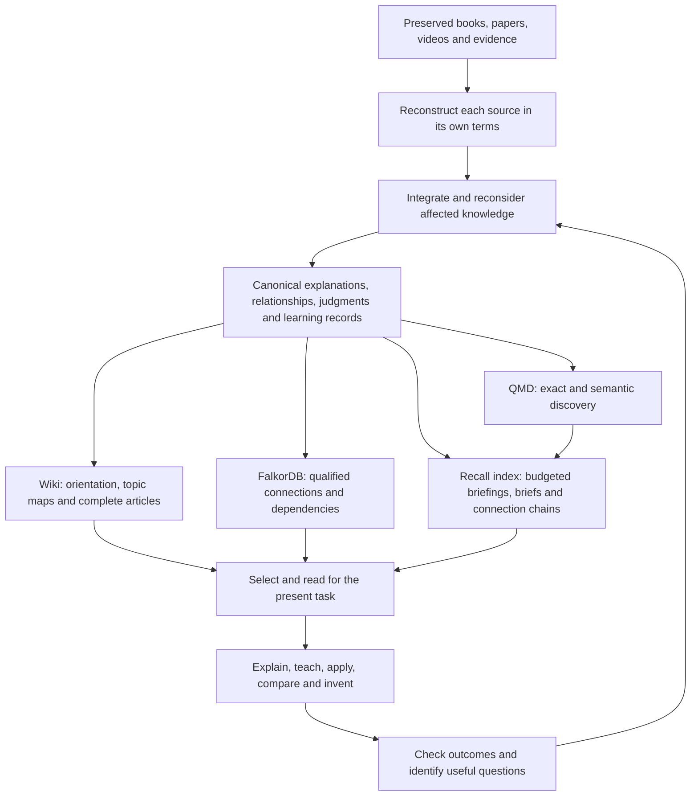

# Know Fu north star and implementation plan

This document holds the product intent and the owner's decisions. The vision and the boundaries come from the original design discussions. The owner approved the full 1.1.0 implementation and a GitHub push on 4 October 2026 ("Confirmed. Build it. And push to github."). The [implementation record](IMPLEMENTATION.md) tracks that delivery. Approval alone is not a claim that anything is installed or validated. Decisions from 5 October 2026 are under "Decisions on 5 October 2026".

## The experience we are building

Feeding Know Fu a source should make the AI a more capable collaborator in that subject. It should gain a lasting, connected understanding that a fresh session can use to explain hard ideas, teach them, recognize when they apply, reconcile disagreements, and develop new ideas, strategies and products.

The guiding image is the "I know kung fu" moment: give the system knowledge, then feel a real jump in what it can do. The model's weights don't change. What compounds is a persistent research library plus capable reasoning and retrieval. The library holds explanations, distinctions, relationships, procedures, examples, judgments, useful questions, and evidence from checked applications.

That intent came before any graph database or wiki was chosen. The original worry was that huge lists of claims would never become coherent understanding. A claim is useful, but an expert also knows why it holds, what it depends on, where it fails and how it connects to other knowledge.

Success shows up in ordinary work. After ingesting relevant material, the AI should be better at these things:

- Explaining a mechanism in coherent prose, including the reasoning that makes it make sense.
- Teaching from prerequisites through examples and near misses, adapting to the learner's actual confusion.
- Applying knowledge to unfamiliar cases, and noticing missing information or failed preconditions.
- Comparing authors without erasing differences in meaning, evidence or scope.
- Combining compatible ideas into a hypothesis, strategy or product proposal, and naming the untested steps.
- Finding the next question or source that would most improve an important decision.
- Revising earlier understanding when new evidence changes it, including dependent explanations and teaching material.

Research-backed software, courses, books, videos and other products are intended uses. Diagnosing a failed application, critiquing a design and planning a discriminating experiment follow naturally. They are product opportunities, not permission to start projects or experiments automatically.

The user supplies sources, priorities and consequential judgments. The system does the reconstruction, organization, reweaving, navigation and routine checking. The user should never have to act as a database librarian or pick a graph mode for each question.

## Commitments that outlast any implementation

The chosen architecture is a machine-oriented research library with full explanations and a maintained wiki. What has to last is how knowledge is represented, connected, revised and used. Components can improve without forcing the research to be redone.

| Commitment | What it means in practice |
|---|---|
| Preserve the source and its meaning | Keep originals, exact locators, useful visual evidence, each author's own argument, and explicit gaps in extraction or interpretation. Converting a file does not mean understanding it |
| Store whole explanations beside addressable claims | Keep mechanisms, procedures, reasoning, examples and exceptions intact at useful sizes. Graph structure must never reduce the library to isolated assertions |
| Make understanding cumulative | New evidence changes the existing accounts it affects, where warranted. Reweaving covers prose, examples, primers, judgments and questions, with a reason for each real revision |
| Keep evidence, interpretation and invention apart | Inference and creative reasoning from named premises are welcome. A model-written explanation, a repeated derivative source or a successful answer is not independent corroboration |
| Treat disagreement as knowledge | Compare definitions, conditions, methods and evidence. Keep unresolved alternatives. Supersede only with a reason and a scope; never pick a winner by age, popularity or confidence |
| Keep fidelity, support and applicability separate | A faithful account of an author's claim can still have weak empirical support, or unknown relevance to the case at hand |
| Make knowledge reachable at several levels | Orientation, topic summaries, complete explanations and original evidence coexist. Summaries guide reading; detail stays available when it matters |
| Evaluate capability | Check explanation, application, exceptions, synthesis and revision in fresh contexts. Record counts, links and successful indexing are infrastructure evidence, not capability |
| Keep one owner of published meaning | Versioned canonical JSON and authored Markdown bodies are the authority. The wiki, FalkorDB and QMD are rebuildable views of a published release |
| Keep specialist research portable and scoped | One modular library with enforced module and source boundaries. Domain tags help discovery. Operational and session memory stay separate |

The implementation choices are the custom TypeScript engine and research adapter, FalkorDB, QMD and Codex reasoning. The Memory Graph application is a design influence, not an installed dependency; keeping the custom adapter was accepted after a comparison.

The first deployment uses local files and software with no required cloud-database subscription. Media transcription goes through APIs by preference. Research can inform general writing, teaching and product skills without needing a research collection about those skills.

Promotion tiers for knowledge, shared writes from several agents, and operational or project memory are deferred. `analogous_to` was excluded, and compatible domains don't imply automatic cross-domain analogy. A book does not become a skill, and fixed quotas of pages, links or probes don't define a successful ingest.

"Every ingest makes it smarter" is the objective. It is not a promise that any material will raise benchmark scores. A redundant source may add little. A weak source may get qualified. A contradicting source may improve judgment by removing false certainty. The useful question after an ingest is what understanding or capability changed, and whether unrelated knowledge stayed sound.

## Decisions on 5 October 2026

The owner reviewed the 1.2.0 audit and rebuild and decided:

- Version 1.2.0 is the line going forward, rather than lifting parts of it into 1.1.0. Its `kb_recall` is the routine answering route. Packet and progressive retrieval stay available for comparison. This replaces the 1.1.0 default named in the plan below.
- A Claude Code adapter will be added once the owner judges the system finished. Shared writes from several agents stay deferred.

Later the same day, after reading the audit report, the owner decided:

- Build `kb_connect` now. It answers "how does A connect to B?" with explicit multi-hop chains over the canonical records, and "what does A reach?" when no target is given. Connecting distant ideas is what drew the owner to the project in the first place.
- Keep FalkorDB for now, as an optional view. Answering doesn't need it: recall's spreading activation and `kb_connect` both run in process over the release. FalkorDB stays useful for visual browsing and ad hoc Cypher queries.
- Make assessments useful. Agents assess evidence on claims that matter for decisions, with a one-line reason, and leave guesses unassessed. Recall shows the levels on each account, and conflicts show both sides' levels next to each other. Levels never rank one side over the other. The owner asked for anything better found in other tools to be adopted; a review of eight of them added a named basis for each evidence level, checked by the engine against the number of independent source families (see the [design lineage](../plugin/docs/lineage.md)).

## One knowledge system, several ways to read it

The wiki is the readable organization of the knowledge. The graph makes specific connections and their conditions addressable. Search finds entry points, including material the topic organization misses. Since 1.2.0, the recall index does most routine answering from the canonical records directly. Codex chooses what to read and reasons with it. None of these parts supplies expertise on its own.

The reading layers are:

| Layer | Contents | Why it exists |
|---|---|---|
| Library orientation | Available topics, short descriptions, scope and links to primers | Find the right area without loading the library |
| Topic map and primer | Essential distinctions, an overview, important tensions, relevant questions, and links with summaries | See the shape of a topic and choose what to read next |
| Complete accounts | Mechanisms, procedures, syntheses, positions kept per source, worked examples and teaching sequences | Supply enough connected reasoning to understand and apply an idea |
| Supporting evidence | Exact passages, source pages and frames, calculations and evidence assessments | Settle a consequential detail, ambiguity or challenge |

A concept can appear in several topic maps under one canonical identity. Authors with incompatible definitions keep separate meanings. Topic maps should explain relationships and disagreements, not just list files by type. The folder structure helps navigation; it is not the knowledge model.

The layers are alternative entry points. A broad teaching request may start with a primer. A precise table lookup should go straight to the account or evidence. A compound question may start at several points and bring the results together. Nothing requires a fixed top-down journey.

## Snapshot of engine 1.0.2 on 2 October 2026

This section records what the system did and lacked on 2 October 2026, before the 1.1.0 plan below was built. The [validation record](VALIDATION.md), the current schemas and the runtime are the evidence for current behavior.

The foundation already supported preserved sources, authored prose, typed relationships, learning and question records, staged ingestion, reweaving guidance, publication, lifecycle controls and derived views. The accepted design was still in the schema and the skill. The open issue was whether the workflows that consume knowledge actually delivered it.

The technical-paper pilot preserved and reconstructed a complete source, published 109 records and passed six application checks. Each answer used 55,026 to 74,786 input tokens. Those were fresh answer contexts given a fixed evidence packet, not agents choosing what to read next. The pilot did not show that the graph helps, that retrieval is efficient, that expertise builds up across sources, or that ingestion can run unattended. [Pilot evidence and limits](VALIDATION.md#2026-10-01-representative-technical-paper-pilot)

The gaps were concrete:

| Area | What the code did | What it needed |
|---|---|---|
| Wiki navigation | Pages had summary frontmatter, but the index was a flat list of titles, types and statuses | Topic navigation that shows summaries, primers and meaningful connections |
| Retrieval selection | Search seeds expanded through graph neighbors, recursively cited inputs, qualifications and judgments | Separate candidates and traceability from the content this answer needs |
| Evaluation reading | The runner opened every selected record body before answering | An interactive reading evaluation beside the preserved fixed-packet baseline |
| Purpose handling | A purpose label and small ranking adjustments didn't add up to a teaching, comparison or invention route | Purpose-aware selection with visible reading decisions and completeness checks per task |
| Cumulative learning | Reweaving and rich records were supported, but the pilot covered one source | Show that later ingests improve earlier understanding and keep unrelated competence |

The code anchors were [projections.ts](../src/projections.ts), [retrieval.ts](../src/retrieval.ts), [evaluation.ts](../src/evaluation.ts), [jobs.ts](../src/jobs.ts) and the [retrieval guide](../plugin/skills/know-fu/references/retrieval.md).

The main correction was to finish the original architecture for using knowledge. Less repeated or irrelevant reading follows from that. Cutting tokens must never stand in for understanding.

## Research behind the 1.1.0 plan

These primary sources were reread on 2 October 2026. They contribute mechanisms and cautions; none of them proves the Know Fu changes work. Branch links can change, so the papers name the versions reviewed. The sources behind 1.2.0 are in the [design lineage](../plugin/docs/lineage.md).

| Reference | Relevant finding | How Know Fu uses it, and the limit |
|---|---|---|
| [Karpathy LLM Wiki, Indexing and logging](https://gist.github.com/karpathy/442a6bf555914893e9891c11519de94f) | A maintained synthesis builds up between queries; a linked index carries short summaries | Keep the compiled understanding and give it useful navigation. Know Fu keeps its own ownership model |
| [nvk indexing](https://github.com/nvk/llm-wiki/blob/master/claude-plugin/skills/wiki-manager/references/indexing.md) and [Query Lite](https://github.com/nvk/llm-wiki/blob/master/claude-plugin/skills/wiki-manager/references/query-lite.md) | Master, category and article navigation, with selective reads of articles and sources | Borrow summary-led discovery. Keep release and hash freshness, direct lookup and engine ownership. Its indexing page's rebuild-on-read advice conflicts with Query Lite's read-only rule, and neither becomes Know Fu's publication protocol |
| [Ars Contexta Reweave](https://github.com/agenticnotetaking/arscontexta/blob/main/skill-sources/reweave/SKILL.md) | Older notes can be reconsidered in light of newer knowledge, including explanations, challenges and examples | Make the backward revision pass a normal part of ingestion. Don't import the framework, its approval defaults or its mechanical splitting rules |
| [RAPTOR v1, retrieval methods](https://arxiv.org/html/2401.18059v1) | Retrieval can combine abstraction levels. The reported main method searches across levels, which beat fixed tree traversal in their comparison | Index summaries and detailed accounts as entry points. Don't require root-first routing or assume a summary tree improves quality by itself |
| [GraphRAG DRIFT, Methodology](https://microsoft.github.io/graphrag/query/drift_search/) | Community reports guide follow-up local searches | Use an overview to form targeted subquestions for broad tasks. No GraphRAG installation and no compulsory global pass |
| [Scideator v1](https://arxiv.org/html/2409.14634v1) | Purpose, mechanism and evaluation facets support grounded idea exploration; judging novelty needs comparison material | Use facets where they help, and keep premises, differences and a proposed test. Cross-domain combinations stay selective; retrieved novelty is not proof of global novelty |
| [Progressive Disclosure ablation v1](https://arxiv.org/html/2607.04576v1) | It changes access structure while holding page bodies constant; results vary with task breadth and tool conditions | Borrow the controlled comparison. Its failed preregistered grading-reliability gate, and its sensitivity to how correctness and completeness are scored, rule out reading its headline as universal no-loss evidence |

## The 1.1.0 implementation plan

The owner approved this plan on 4 October 2026, and [IMPLEMENTATION.md](IMPLEMENTATION.md) records its delivery. Version 1.2.0 later replaced its default reading route (see the decisions above). The plan's rules about qualifications, scope, budgets, reweaving and evaluation still apply to every read path.

The phases ordered the delivery of the complete architecture. They did not turn teaching, synthesis or invention into optional extras. Each phase had a reviewable outcome and kept the existing library intact.

### 1. Freeze the behavioral contract and comparison material

Keep this document as the entry point for intent. Add representative questions for explanation, teaching, application, comparison, invention, broad synthesis and missing evidence. Find the decisive conditions in the original sources and what a good answer has to show. Include unfamiliar applications, not paraphrases of stored examples.

Freeze the pilot release and keep its fixed-packet results. Use some exposed cases as engineering regressions and keep separate cases for acceptance. Set up a small sequence of related sources for the cumulative-learning test: a foundational account, a complementary one, and material that adds a qualification or a real disagreement. Choose sources that fit the intended research use. A fictional sequence can test mechanics but can't show real expertise.

Output: a matrix from behavior to evidence, and a frozen baseline. The user can inspect what "more capable" means before the implementation is judged.

### 2. Build summary-led navigation over the existing knowledge

In the projection builder, produce a compact library index, topic indexes and links to existing `learning` primers. Generate a machine-readable catalogue from the same release and record identities. Keep originals, relationship records and audit detail reachable without putting them all in the main reading list.

A catalogue entry carries an exact record reference, title, useful summary, form, domain and topic membership, lifecycle and freshness status, and links to open the full account. Reuse `knowledge.summary`, concept definitions and existing learning and question fields where they give a faithful short account. Where a record needs an authored navigation summary, add a small optional, versioned metadata field rather than generating a new LLM summary on every read. A missing summary stays visibly missing until someone writes it; a title never passes for a useful explanation.

Primers and topic syntheses stay canonical authored knowledge. Membership and link rendering come from explicit references. A summary's dependencies stay traceable, so later corrections mark it stale. Never build a summary only from an older summary when the original account or a material qualification needs checking.

Index summaries and full accounts for search as distinct result levels with one underlying identity, and never count a summary and its body as two sources. Filter catalogue results, memberships and counts by scope before showing them; a root index must not reveal research the reader can't access. Large catalogues need pagination or topic lookup, not a whole-catalogue preload.

Likely code: `src/projections.ts`, `src/maintenance.ts`, the search mapping, and only where needed `contracts/schemas/record.schema.json` and proposal compilation.

Done when a fresh session can find the right topic, tell competing accounts apart and open the explanation; edits that keep record counts the same still invalidate stale navigation; and titles and summaries outside scope don't leak.

### 3. Separate discovery, necessary context and provenance

Add a progressive mode to `kb_retrieve` and keep the packet mode for compatibility and comparison. A first response presents candidate accounts with a short account of conditions, counterevidence, current judgments, freshness and next reads. It doesn't paste every linked source body.

`depends_on` has two uses to keep apart. A record's top-level dependency references preserve its exact inputs and drive invalidation. A relationship whose predicate is `depends_on` states a conceptual prerequisite. Neither means every transitive body belongs in every answer. Keep all references and the existing withdrawal propagation, and choose what to read by meaning.

Retrieval has three roles:

| Role | What it gives |
|---|---|
| Orientation candidates | Enough to decide whether an account matters |
| Necessary reading | The explanation, plus any prerequisite, qualification, challenge or judgment needed to avoid a materially misleading answer |
| Traceable support | Exact supporting references for verification and deeper reading |

Known qualifications of selected knowledge surface independently of search rank. The model must not drop an inconvenient qualification to fit a budget. If a short statement can't carry it safely, flag the full account as necessary reading. If required evidence is inaccessible, stale or too long for the remaining budget, say so and avoid a settled answer.

Follow typed relationships with their direction, scope and rationale. Prevent cycles and duplicate reads by exact reference and content identity. Search stays available across disconnected parts. No fixed hop count proves completeness, and being close in the structure is not evidence of causation or valid transfer.

Budgets cover the evidence actually rendered and the cumulative model input, including repeated context, metadata and tool calls. Track estimates separately from measured usage. Allow wider reading for broad questions, and reserve room for important caveats and the final reasoning. Return omitted candidates, outstanding necessary reads and the reasons for any cut explicitly, without revealing unauthorized content.

Likely code: `src/retrieval.ts`, `src/graph-projection.ts`, `src/api.ts`, `contracts/schemas/retrieval.schema.json` and generated types. Split discovery, qualification resolution and packet assembly into internal modules if that makes their contracts easier to test.

Done when a narrow question avoids reading unrelated full sources, still finds a low-ranked exception, handles an unknown condition, and keeps exact historical inputs and current lifecycle restrictions.

### 4. Make progressive reading part of normal Codex work

Extend the read and retrieve interfaces to return topic navigation and open selected records. Keep full-record reads. If long accounts need section reads, use stable section locators and hashes bound to the release, and carry the record's material scope and warnings with each section. Never present an arbitrary character cut as a complete unit of reasoning.

The retrieval guide leads Codex to establish the task, choose an entry point, inspect candidates, open the needed explanations, settle consequential conditions and fetch more evidence where uncertainty remains. It stops when the answer's material requirements are met, or reports what blocks it. The reasoning stays with Codex; the engine enforces scope, identity, lifecycle and an honest completeness status.

| The user's task | Reading should settle |
|---|---|
| Explain | What it means, why it works, and the boundary that changes the explanation |
| Teach | Prerequisites, a coherent learning sequence, worked cases and likely misunderstandings |
| Apply | Decision criteria, necessary inputs, failed preconditions and what the conclusion allows |
| Compare | Each account's definition, scope, strongest relevant evidence and unresolved differences |
| Invent | Useful mechanisms, compatible assumptions, prior attempts, missing links and a discriminating test |
| Synthesize broadly | Coverage of the relevant topic branches, minority positions and exceptions |
| Investigate | What is known, the consequential gap, and which next action could close it |

A topic summary can orient the answer, but detailed assertions must rest on inspected accounts. Exact quotations, disputed calculations and ambiguous visual evidence need their primary evidence. Model knowledge can help explain or suggest a hypothesis, but must never be attributed to the library.

Likely code and guidance: `src/api.ts`, `src/mcp.ts`, `src/store.ts`, the Know Fu skill and the retrieval guide. New interface names and fields need versioned contracts before implementation.

Done when a fresh installed-plugin session runs the reading sequence through the real tools, with a trace explaining what it chose to read and why, and answers accurately without a preassembled full packet.

### 5. Make each ingest revise the understanding that matters

Keep the reconstruct, integrate, discover, reweave, compile, check and publish workflow. Strengthen the evidence that each stage was really done rather than adding ceremonial stages.

Reconstruct the new source before comparing it with the library, so existing beliefs don't rewrite the author. Use search, topic maps and qualified dependencies to find affected knowledge. Reconsider the explanation, not just its links: a new source might narrow a procedure, expose incompatible definitions, supply a missing mechanism, or change the most useful next question.

Update affected summaries, primers, learning records and questions together with the accounts they belong to. An affected account left unreassessed stays visibly pending. Dependents outside the authorized maintenance scope stay flagged for follow-up. Check that something is current before reusing it; never present a stale primer as settled orientation.

An ingestion report says what the system can now explain or apply better, what earlier understanding changed, what remains unresolved and what was checked. "This source adds no new supported understanding" is a valid result when it is defensible. Counts and coverage receipts go with the explanation; they don't replace it.

Likely code and guidance: `src/jobs.ts`, `src/store.ts`, impact handling, the ingestion, books and video guides, and freshness checks for navigation. The existing extraction policy stays in force.

Done when a second or third source changes a relevant earlier explanation and its teaching route, keeps the original author's account, exposes unresolved disagreement, and leaves unrelated knowledge usable.

### 6. Treat teaching, invention and the question backlog as core uses

Use existing learning, knowledge and question records before adding record types. Teaching develops the reasoning and diagnoses a likely misunderstanding. Application keeps the steps that decide whether a method fits. Invention combines mechanisms with an explanation of the proposed connection, its assumptions, the evidence behind each premise, and the test that could disprove it.

Search by purpose, mechanism and constraints where it helps. Allow cross-domain exploration when the task warrants it and the scopes allow it. Record why the transfer might work and where it could fail. Finding no worthwhile combination beats manufacturing novelty.

Rank questions by the decision they could change, the dependencies they could unblock, the uncertainty, and the cost of answering them. A sparse spot in the graph is not by itself a valuable gap. Keep a small reasoned set of next actions for the current task, and keep the wider backlog.

Reuse valuable checked explanations and applications through the normal authorized publication workflow. Keep speculative proposals marked as such. A good chat answer doesn't authorize an autonomous research campaign, and a generated exercise is not empirical validation of its premise.

Done when fresh sessions can teach a difficult distinction, apply it to a new case, propose a defensible extension and identify a worthwhile missing test from the same library. Quality and correctness matter more than how many learning or idea records exist.

### 7. Evaluate the system we intend to use

Extend the evaluator with a constrained interactive mode. It exposes only the pinned library and permitted read-only retrieval tools, and denies unrelated files, network sources and hidden answer material. Recheck current withdrawal, deletion and permissions even during a pinned-release run. Verify isolation before counting results.

Record selected summaries, full, section and source reads, graph expansions, unmet reading requirements, actual input and output usage, repeated context, latency and answer citations. Keep the fixed-packet evaluator as a separately named baseline, and never relabel old results as agentic retrieval.

Run two comparisons, because they answer different questions:

1. Access structure. Hold the page bodies and the release constant, and compare the packet route with progressive routes, with and without optional graph exploration. Keep material qualification checks in every route. This isolates the reading policy.
2. Cumulative knowledge. Compare capability before and after the related-source sequence, then against original-passages-only and no-library conditions where useful. This tests whether synthesis and reweaving add usable understanding. Repeat unaffected tasks to check retention.

Use realistic budgets and report matched-budget comparisons separately. Count the whole reading trajectory, not just the final prompt. Repeat important cases to expose variability. Paraphrases of one case are not independent evidence.

Grade correctness, completeness, conditions, citation support, coherent teaching, useful synthesis, justified inference and recognition of gaps separately. A reviewer with the sources inspects disputed grades, especially calculations and visual evidence. A grader's instruction is never authority to rewrite the library; earlier validation showed that failure directly.

Adoption needs preserved or improved quality with useful reading efficiency on the intended tasks, plus every lifecycle and scope regression passing. Broad synthesis may need more reading. No aggregate score may hide a lost decisive condition or a completeness failure. Set thresholds per task before comparing; don't invent a universal token-saving percentage as a product requirement.

Likely code: `src/evaluation.ts`, the evaluation contracts and isolated runner tests. Keep exposed repairs, held-out cases and human or coordinator review distinguishable.

### 8. Roll out without rewriting the research

Ship navigation and progressive reading as an additive, versioned capability. Existing records and the old route stay readable. Rebuild derived views from the pinned library, and review any authored navigation additions as normal revisions. Keep source ids, locators, reading receipts, disagreements and lifecycle history. A search-index rebuild is not a new ingestion.

After the comparisons and fresh-session checks, make the winning reading policy the default and update the installed plugin. Check the packaged contracts, real MCP behavior, source-image access, view freshness, and interruption and resume. Then migrate one coherent slice of research under supervision, with the preservation checks already established. Large historical migrations and any change to the production binding need their own authorization.

Keep future retrieval algorithms behind the same ownership and evidence contracts. A better backend or ranking should never require reconstructing every book.

## Keeping future work aligned

Read this document before proposing a material change to architecture, ingestion, retrieval or evaluation. Then read the specific code and guides the task needs, not the whole design history.

For each material change, say which capability it improves, what understanding it might lose, how it keeps the boundary between source and evidence, and what observation would show it worked. Keep the established vision, current implementation facts and unaccepted proposals apart. A conversation summary, an old assistant recommendation or a convenient library default never silently replaces an explicit decision by the owner.

When the owner changes a decision, record the reason here and update the affected technical docs. Keep historical evidence, but don't maintain competing current specifications. This document governs intent; the schemas and runtime describe current mechanics; [VALIDATION.md](VALIDATION.md) records what has been shown. New direction from the owner can revise any decision.

The 1.1.0 build was delivered with installed-tool checks and controlled application evidence, recorded in [IMPLEMENTATION.md](IMPLEMENTATION.md). Version 1.2.0 followed on 5 October 2026 and is the line the owner chose to continue. Its budgeted recall replaced the packet as the routine route after a blind comparison found equal answer quality at about one-eighth of the material. [ROADMAP.md](ROADMAP.md) holds the current task list and open questions, and [VALIDATION.md](VALIDATION.md) the outcomes and limits. Production migration and wider independent capability testing remain separate work. Keep the earlier pilots, and keep implemented mechanisms distinct from demonstrated capability.
