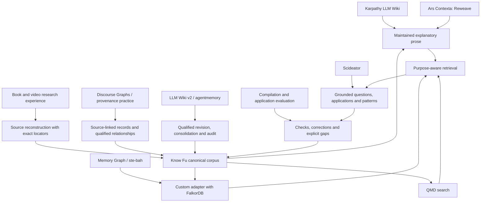

# Design lineage

Know Fu combines a custom research workflow with a small set of existing components. This map distinguishes **code dependencies**, **borrowed principles**, **comparative research** and **choices deliberately left out**. An arrow here means influence, not a software dependency or a reproduced benchmark result.

## Principal design influences

| Influence | Contribution to Know Fu | Boundary |
|---|---|---|
| [Andrej Karpathy's LLM Wiki gist](https://gist.github.com/karpathy/442a6bf555914893e9891c11519de94f) | A cumulative, navigable body of synthesized knowledge that improves as sources arrive | Conceptual origin. The gist is not a software package we install |
| [Ars Contexta, especially Reweave](https://github.com/agenticnotetaking/arscontexta) | Revisit existing explanations when new evidence changes their premises; retain the reason a connection matters | Selective philosophy. No full Ars Contexta framework, Claude hooks or competing writer |
| [LLM Wiki v2 by rohitg00](https://gist.github.com/rohitg00/2067ab416f7bbe447c1977edaaa681e2) and [agentmemory](https://github.com/rohitg00/agentmemory) | Confidence assessment, scoped supersession, consolidation, auditability, filtering and governed bulk work | Know Fu separates fidelity, evidence and applicability. Repetition is not independent evidence; mesh sync and automatic crystallization into skills are deferred |
| [Discourse Graphs](https://joelchan.me/assets/pdf/Discourse_Graphs_for_Augmented_Knowledge_Synthesis_What_and_Why.pdf) | Inspectable links among questions, claims and evidence | Expanded here with full explanations, mechanisms, procedures and source-specific accounts |
| [W3C PROV-O](https://www.w3.org/TR/prov-o/) and [n-ary relationships](https://www.w3.org/TR/swbp-n-aryRelations/) | Qualified relationships with their own identity, provenance and conditions | Conceptual influence; JSON Schema and a property graph are used, not an RDF/SHACL runtime |
| [Memory Graph upstream](https://github.com/memory-graph/memory-graph), [ste-bah](https://github.com/ste-bah), and [his Memory Graph fork](https://github.com/ste-bah/memory-graph) | Graph-backend experience and emphasis on capable relationship queries; FalkorDB as the chosen graph backend | Know Fu has a custom research graph adapter. The Memory Graph application/fork is **not** installed or vendored |
| [Scideator](https://arxiv.org/abs/2409.14634) | Purpose, mechanism and evaluation facets as useful prompts for grounded idea discovery and application | Borrowed representations and questions, not a forced analogy engine or proof that an idea is novel |
| Prior book/PDF and video ingestion work | Edition identity, complete requested coverage, dual transcript comparison, exact locators, native visual evidence, decision-time versus hindsight, and cumulative synthesis | Generalized workflows in the book/video references; private source material and conversation transcripts are not distributed |
| Cross-model design review | Sharpened primers, learning/application records, compact semantic authoring, materiality, question backlogs and independent evaluation | Suggestions were assessed individually. No wholesale import of another assistant's architecture or private session files |

## Research that informed comparisons

These informed questions and design tradeoffs; their algorithms and performance claims are not implementation claims about Know Fu.

- [HippoRAG 2](https://arxiv.org/abs/2502.14802), [GraphRAG](https://microsoft.github.io/graphrag/) and [RAPTOR](https://arxiv.org/abs/2401.18059): retain passage context and vary retrieval depth with the task. Know Fu uses scoped search, canonical record reads and selected graph expansion, not these complete pipelines.
- [EntiGraph](https://arxiv.org/abs/2409.07431): explanatory relational text can carry more useful context than disconnected assertions. Its model-training procedure is not part of this system.
- [WiCER](https://arxiv.org/abs/2605.07068) and [Potemkin Understanding](https://arxiv.org/abs/2506.21521): compiling an explanation and applying it correctly are separate things to check. Self-generated probes are not independent proof of mastery.
- [STORM](https://github.com/stanford-oval/storm), [PaperQA2](https://arxiv.org/abs/2409.13740), [SciMON](https://aclanthology.org/2024.acl-long.18/) and [SciAgents](https://arxiv.org/abs/2409.05556): perspective-taking, evidence-seeking and grounded ideation. None is a second ingestion owner in Know Fu.
- [A-MEM](https://arxiv.org/abs/2502.12110) and [contextual retrieval](https://www.anthropic.com/engineering/contextual-retrieval): updating old knowledge and retrieving enough context to interpret passages correctly.
- [ste-bah's Archon](https://github.com/ste-bah/archon-cli): a comparison for operational memory and implementation boundaries. Know Fu does not adopt Archon's complete research philosophy or runtime.

## Actual software dependencies

| Component | Role |
|---|---|
| Node.js, TypeScript, AJV, JSON Schema | Custom coordinator, authoring contracts and validation |
| [MCP TypeScript SDK](https://github.com/modelcontextprotocol/typescript-sdk) | Local tool interface |
| [FalkorDB](https://github.com/FalkorDB/FalkorDB) and its [official TypeScript client](https://github.com/FalkorDB/falkordb-ts) | Rebuildable graph projection and queries |
| [QMD](https://github.com/tobi/qmd) | Local keyword/vector retrieval over generated documents |
| [Docling](https://github.com/docling-project/docling), direct format readers and PDF/image libraries | Conversion, page/asset rendering and locators |
| [FFmpeg](https://ffmpeg.org/) | Media inspection, audio preparation and visual evidence extraction |
| Configured speech APIs | Optional paid media transcription; independent from the reasoning harness subscription |

Exact packages are in the repository lockfiles. Upstream dependency licenses remain applicable. The repository does not bundle models, a database binary or a copy of Memory Graph.

Development formatting uses pinned Prettier 3.9.9. The cache, batched graph writer and QMD worker are Know Fu implementation code; they add no separate research owner or model provider. The worker calls QMD's official SDK and retains the existing local CPU search deployment.

There is one local compatibility patch: `scripts/patch-falkordb.mjs` adds an early error listener to the pinned **official FalkorDB client 6.8.0**, allowing connection failure to reject rather than crash before a caller can attach a listener. It is version-guarded and applied at build time. This is a Know Fu patch, **not ste-bah's Memory Graph patch**.

## Considered, not adopted

[nvk/llm-wiki](https://github.com/nvk/llm-wiki) reinforced immutable raw material, synthesis, honest gaps, structured metadata and audit/index hygiene. It is an independent implementation, not Karpathy's official package. Its Markdown-as-authority arrangement was not adopted: Know Fu owns meaning in canonical JSON plus Markdown bodies and derives the wiki.

LanceDB plus hosted embeddings/reranking was an earlier proposal; QMD was selected instead. Basic Memory, Cognee, LightRAG and complete agentmemory installations would overlap with the custom ingestion/meaning owner. They are not mandatory dependencies. Jev remains a possible future routing optimization. Promotion tiers, `analogous_to`, cross-harness shared writes and project operational memory remain deferred.

## Memory Graph fork question

A separate preparatory exercise reconciled then-current TypeScript Memory Graph upstream with relevant ste-bah fixes. That candidate is not a dependency of this repository. Know Fu's graph code calls the official FalkorDB client directly and projects Know Fu's own research schema. No Memory Graph fork is needed to install it.

If code from that candidate is adopted later, record the exact upstream/fork revisions, retained patches, license, provenance and live tests here and in the change log. A maintained public fork or versioned patch series can then be evaluated on its merits; creating a fork now would introduce a dependency we do not use.
