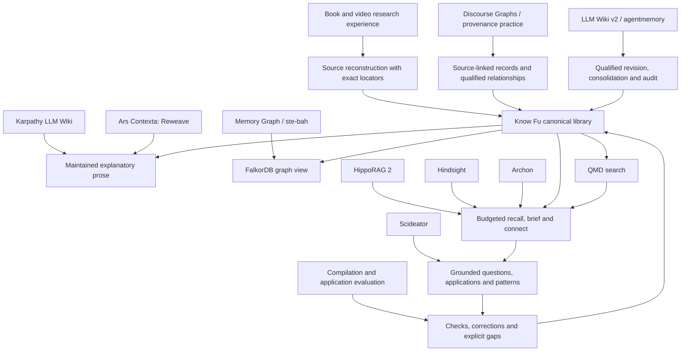

# Design lineage

Know Fu is a custom research workflow sitting on a handful of existing components, and it borrowed ideas from a lot of places along the way. This page keeps four things apart that are easy to blur: code it actually depends on, ideas it borrowed, research it compared itself against, and things it left out on purpose. An arrow in the map means "influenced". It doesn't mean a software dependency, and it doesn't mean anyone reproduced a benchmark.

## The main influences

| Influence | What Know Fu took | Where it stops |
|---|---|---|
| [Andrej Karpathy's LLM Wiki gist](https://gist.github.com/karpathy/442a6bf555914893e9891c11519de94f) | A cumulative, navigable body of synthesized knowledge that improves as sources arrive | The conceptual origin. The gist isn't a package Know Fu installs |
| [Ars Contexta, especially Reweave](https://github.com/agenticnotetaking/arscontexta) | Revisit existing explanations when new evidence changes their premises, and keep the reason a connection matters | Selected ideas only. No Ars Contexta framework, Claude hooks or second writer |
| [LLM Wiki v2 by rohitg00](https://gist.github.com/rohitg00/2067ab416f7bbe447c1977edaaa681e2) and [agentmemory](https://github.com/rohitg00/agentmemory) | Confidence assessment, scoped supersession, consolidation, auditability, filtering and governed bulk work | Know Fu splits confidence into fidelity, evidence and applicability, as levels with reasons rather than one fused number, and repetition never counts as independent evidence. Mesh sync and automatic crystallization into skills are deferred |
| [Discourse Graphs](https://joelchan.me/assets/pdf/Discourse_Graphs_for_Augmented_Knowledge_Synthesis_What_and_Why.pdf) | Inspectable links among questions, claims and evidence | Know Fu adds full explanations, mechanisms, procedures and accounts kept per source |
| [W3C PROV-O](https://www.w3.org/TR/prov-o/) and [n-ary relationships](https://www.w3.org/TR/swbp-n-aryRelations/) | Relationships with their own identity, provenance and conditions | Conceptual only. Know Fu uses JSON Schema and a property graph, not an RDF or SHACL runtime |
| [Memory Graph upstream](https://github.com/memory-graph/memory-graph), [ste-bah](https://github.com/ste-bah) and [ste-bah's Memory Graph fork](https://github.com/ste-bah/memory-graph) | Experience with graph backends and capable relationship queries; FalkorDB as the graph backend | Know Fu has its own graph adapter. The Memory Graph application and fork aren't installed or vendored |
| [Scideator](https://arxiv.org/abs/2409.14634) | Purpose, mechanism and evaluation facets as prompts for grounded idea finding and application | Borrowed questions, not an analogy engine or proof that an idea is new |
| Earlier book, PDF and video ingestion work | Edition identity, complete requested coverage, two transcripts compared, exact locators, native visual evidence, decision-time versus hindsight, cumulative synthesis | Generalized into the book and video guides. Private source material and conversation transcripts aren't distributed |
| Cross-model design review | Sharper primers, learning and application records, compact semantic authoring, materiality, question backlogs and independent evaluation | Each suggestion was judged on its own merits. No other assistant's architecture or private session files came in |

## What 1.2.0 took from HippoRAG, Hindsight and Archon

Version 1.2.0 rebuilt answering around a budgeted briefing, and most of the good ideas behind it came from three places. The code is all Know Fu's own; nothing was copied.

| Source | The idea | How Know Fu uses it |
|---|---|---|
| [HippoRAG 2](https://arxiv.org/abs/2502.14802) | Personalized PageRank from query-matched seeds finds records several links away that keyword search misses | `kb_recall` spreads activation over typed relationships, structural references and citations, with a restart probability of 0.35 and 30 iterations. It doesn't build a knowledge graph from extracted triples |
| [Hindsight](https://github.com/vectorize-io/hindsight) (Vectorize, MIT) | Reciprocal rank fusion with k = 60; packing results in rank order to a token budget; scoped staleness; limits on hub fan-out; stripping internal fields from tool payloads; generated pages never used as evidence for other generated pages | `kb_recall` fuses keyword, semantic and graph ranks with k = 60 and packs to a budget, listing what didn't fit. `kb_brief` calls a primer stale only when its own domain changed in a later release. `kb_connect` adds a hub penalty. Compact MCP rendering drops raw fields. A filed answer never counts as an extra source |
| [Archon](https://github.com/ste-bah/archon-cli) by ste-bah (MIT) | File good answers back into the library; check quotes against the source text; return conflicts with the answer instead of hiding them; test retrieval with blind comparisons and honest gates | `kb_file`, `extensions.citations` with quote checks at staging and publication, caveats packed beside what they qualify, and the blind A/B method recorded in the engine's `docs/VALIDATION.md` |

Just as useful was what got left on the shelf. Hindsight's server-side reflect loop, background consolidation workers and its own LLM calls stayed out: in Know Fu the coding agent is the loop, and the engine never calls a model itself. Archon's regex claim extraction, polarity-based contradiction detection and source-quality scores stayed out too, because an agent actually reading the source does those jobs better.

## Confidence: what other tools do, and what Know Fu took

On 5 October 2026 a review read how eight tools in this lineage handle confidence: the LLM Wiki v2 gist, agentmemory, nvk/llm-wiki, Ars Contexta, Memory Graph and ste-bah's fork, PaperQA2, Basic Memory and Cognee. Nothing was run; the review read code, prompts and papers at pinned commits.

Three habits kept turning up, and Know Fu avoids all of them:

- Counting repetition as support. Five places do this. In agentmemory, for example, saving the same lesson text again raises its confidence.
- Letting time and recency decide. Agentmemory lowers confidence as weeks pass, and automatically keeps the newer of two near-duplicates.
- Keeping scores nobody uses. Several tools store scores that nothing reads, or counters that nothing writes.

Know Fu took three things in return. Anchoring a level to the kind of support, an idea from nvk/llm-wiki's rubric and agentmemory's starting values by origin, became the evidence `basis`, which the engine checks against the number of independent source families. PaperQA2 reports that its experts agreed with claims scored 8 just as often as with claims scored 9 or 10; finer grades bought nothing, which backs keeping levels coarse. And nvk/llm-wiki's thesis mode, which sets the case for and against side by side with what would change the verdict, matches Know Fu's side-by-side lines and the judgment's `what_would_change`.

Left out: fused 0-1 numbers, decay with time, reinforcement by repetition, automatic winners and forgetting by access. Two more ideas from the review became roadmap tasks 17 and 18.

## Research it compared itself against

These shaped questions and trade-offs. Their algorithms and performance claims aren't claims about Know Fu.

- [GraphRAG](https://microsoft.github.io/graphrag/) and [RAPTOR](https://arxiv.org/abs/2401.18059): keep passage context, and vary retrieval depth with the task. Know Fu uses scoped search, exact record reads and selected link expansion, not these full pipelines.
- [EntiGraph](https://arxiv.org/abs/2409.07431): explanatory text about relations can carry more useful context than disconnected assertions. Its model-training procedure isn't part of Know Fu.
- [WiCER](https://arxiv.org/abs/2605.07068) and [Potemkin Understanding](https://arxiv.org/abs/2506.21521): writing an explanation and applying it correctly are two different things to check. Probes a system writes for itself aren't independent proof of mastery.
- [STORM](https://github.com/stanford-oval/storm), [PaperQA2](https://arxiv.org/abs/2409.13740), [SciMON](https://aclanthology.org/2024.acl-long.18/) and [SciAgents](https://arxiv.org/abs/2409.05556): taking perspectives, seeking evidence, grounded idea generation. None of them owns any part of ingestion here.
- [A-MEM](https://arxiv.org/abs/2502.12110) and [contextual retrieval](https://www.anthropic.com/engineering/contextual-retrieval): updating old knowledge, and retrieving enough context to read a passage correctly.

## What it actually runs on

| Component | Role |
|---|---|
| Node.js, TypeScript, AJV, JSON Schema | The engine, its authoring contracts and validation |
| [MCP TypeScript SDK](https://github.com/modelcontextprotocol/typescript-sdk) | The local tool interface |
| [yaml](https://github.com/eemeli/yaml) 2.9.0 | Frontmatter in `kb_write` notes. Already installed through QMD at the same version |
| [FalkorDB](https://github.com/FalkorDB/FalkorDB) and its [official TypeScript client](https://github.com/FalkorDB/falkordb-ts) | The rebuildable graph view and its queries |
| [QMD](https://github.com/tobi/qmd) | Local keyword and vector search over generated documents |
| [Docling](https://github.com/docling-project/docling), direct format readers and PDF and image libraries | Conversion, page and asset rendering, locators |
| [Poppler](https://poppler.freedesktop.org/) | A second PDF text and layout extraction. Installed separately as a command-line tool |
| [resvg-js](https://github.com/yisibl/resvg-js) 2.6.2 (MPL-2.0) | SVG-to-PNG previews for EPUB assets. The original SVG bytes are kept |
| [FFmpeg](https://ffmpeg.org/) | Media inspection, audio preparation and visual evidence |
| Configured speech APIs | Optional paid media transcription, billed separately from the agent subscription |

The exact packages are in the lockfiles, and their licenses still apply. The repository bundles no models, no database binary and no copy of Memory Graph. Formatting uses pinned Prettier 3.9.9. The cache, the batched graph writer and the QMD worker are Know Fu's own code; the worker calls QMD's official SDK on the existing local CPU search setup.

There's exactly one local compatibility patch. `scripts/patch-falkordb.mjs` adds an early error listener to the pinned official FalkorDB client 6.8.0, so a failed connection rejects cleanly instead of crashing before a caller can attach a listener. It's version-guarded and applied at build time. It's a Know Fu patch, not ste-bah's Memory Graph patch.

## Considered, and passed on

[nvk/llm-wiki](https://github.com/nvk/llm-wiki) reinforced several good habits: immutable raw material, synthesis, honest gaps, structured metadata, and tidy audit and index files. It's an independent project, not Karpathy's. Its arrangement of Markdown as the authority didn't fit, though. Know Fu keeps meaning in canonical JSON plus Markdown bodies and generates the wiki from them.

LanceDB with hosted embeddings and reranking was an earlier proposal; QMD won. Basic Memory, Cognee, LightRAG and a full agentmemory install would each overlap with Know Fu's own ingestion and meaning, so none is required. Jev is still a possible future routing optimization. Promotion tiers, `analogous_to`, shared writes across agents and project operational memory are deferred.

## The Memory Graph fork question

A separate exercise once reconciled the TypeScript Memory Graph upstream of the day with relevant fixes from ste-bah. That candidate isn't a dependency. Know Fu's graph code calls the official FalkorDB client directly and projects Know Fu's own research schema, so installing it needs no Memory Graph fork at all.

If code from that candidate ever gets adopted, record the exact upstream and fork revisions, the patches kept, the license, the provenance and the live tests here and in the change log. A maintained public fork or a versioned patch series can then be judged on its merits. Creating a fork now would just add a dependency nothing uses.
