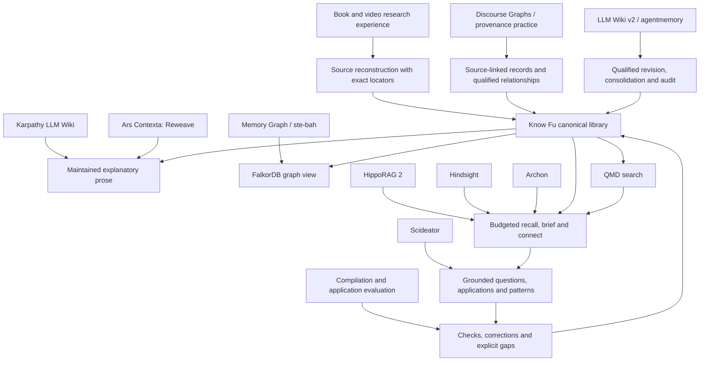

# Design lineage

Know Fu is a custom research workflow sitting on a handful of existing components, and it borrowed ideas from a lot of places along the way. This page keeps four things apart that are easy to blur: code it actually depends on, ideas it borrowed, research it compared itself against, and things it left out on purpose. An arrow in the map means "influenced". It doesn't mean a software dependency, and it doesn't mean anyone reproduced a benchmark.

## The main influences

| Influence | What Know Fu took | Where it stops |
|---|---|---|
| [Andrej Karpathy's LLM Wiki gist](https://gist.github.com/karpathy/442a6bf555914893e9891c11519de94f) | A cumulative, navigable body of synthesized knowledge that improves as sources arrive | The conceptual origin. The gist isn't a package Know Fu installs |
| [Ars Contexta, especially Reweave](https://github.com/agenticnotetaking/arscontexta) | Revisit existing explanations when new evidence changes their premises, and keep the reason a connection matters | Selected ideas only. No Ars Contexta framework, Claude hooks or second writer |
| [LLM Wiki v2 by rohitg00](https://gist.github.com/rohitg00/2067ab416f7bbe447c1977edaaa681e2) and [agentmemory](https://github.com/rohitg00/agentmemory) | Confidence assessment, scoped supersession, consolidation, auditability, filtering and governed bulk work | Know Fu splits confidence into fidelity, evidence and applicability, as levels with reasons rather than one fused number, and repetition never counts as independent evidence. Mesh sync and automatic crystallization into skills are deferred |
| [Discourse Graphs](https://joelchan.me/assets/pdf/Discourse_Graphs_for_Augmented_Knowledge_Synthesis_What_and_Why.pdf) | Inspectable links among questions, claims and evidence | Know Fu adds full explanations, mechanisms, procedures and accounts kept per source |
| [W3C PROV-O](https://www.w3.org/TR/prov-o/) and [n-ary relationships](https://www.w3.org/TR/swbp-n-aryRelations/) | Relationships with their own identity, provenance and conditions | Conceptual only. Know Fu uses JSON Schema and a property graph, not an RDF or SHACL runtime |
| [Memory Graph upstream](https://github.com/memory-graph/memory-graph), [ste-bah](https://github.com/ste-bah) and [ste-bah's Memory Graph fork](https://github.com/ste-bah/memory-graph) | Experience with graph backends and capable relationship queries; FalkorDB as the graph backend | Know Fu has its own graph adapter. The Memory Graph application and fork aren't installed or vendored |
| [Scideator](https://arxiv.org/abs/2409.14634) | Purpose, mechanism and evaluation facets as prompts for grounded idea finding and application | Borrowed questions, not an analogy engine or proof that an idea is new |
| Earlier book, PDF and video ingestion work | Edition identity, complete requested coverage, two transcripts compared, exact locators, native visual evidence, decision-time versus hindsight, cumulative synthesis | Generalized into the book and video guides. Private source material and conversation transcripts aren't distributed |
| Cross-model design review | Sharper primers, learning and application records, compact semantic authoring, materiality, question backlogs and independent evaluation | Each suggestion was judged on its own merits. No other assistant's architecture or private session files came in |

## What 1.2.0 took from HippoRAG, Hindsight and Archon

Version 1.2.0 rebuilt answering around a budgeted briefing, and most of the good ideas behind it came from three places. The code is all Know Fu's own; nothing was copied.

| Source | The idea | How Know Fu uses it |
|---|---|---|
| [HippoRAG 2](https://arxiv.org/abs/2502.14802) | Personalized PageRank from query-matched seeds finds records several links away that keyword search misses | `kb_recall` spreads activation over typed relationships, structural references and citations, with a restart probability of 0.35 and 30 iterations. It doesn't build a knowledge graph from extracted triples |
| [Hindsight](https://github.com/vectorize-io/hindsight) (Vectorize, MIT) | Reciprocal rank fusion with k = 60; packing results in rank order to a token budget; scoped staleness; limits on hub fan-out; stripping internal fields from tool payloads; generated pages never used as evidence for other generated pages | `kb_recall` fuses keyword, semantic and graph ranks with k = 60 and packs to a budget, listing what didn't fit. `kb_brief` calls a primer stale only when its own domain changed in a later release. `kb_connect` adds a hub penalty. Compact MCP rendering drops raw fields. A filed answer never counts as an extra source |
| [Archon](https://github.com/ste-bah/archon-cli) by ste-bah (MIT) | File good answers back into the library; check quotes against the source text; return conflicts with the answer instead of hiding them; test retrieval with blind comparisons and honest gates | `kb_file`, `extensions.citations` with quote checks at staging and publication, caveats packed beside what they qualify, and the blind A/B method recorded in the engine's `docs/VALIDATION.md` |

Just as useful was what got left on the shelf. Hindsight's server-side reflect loop, background consolidation workers and its own LLM calls stayed out: in Know Fu the coding agent is the loop, and the engine never calls a model itself. Archon's regex claim extraction, polarity-based contradiction detection and source-quality scores stayed out too, because an agent actually reading the source does those jobs better.

## Confidence: what other tools do, and what Know Fu took

On 5 October 2026 a review read how eight tools in this lineage handle confidence: the LLM Wiki v2 gist, agentmemory, nvk/llm-wiki, Ars Contexta, Memory Graph and ste-bah's fork, PaperQA2, Basic Memory and Cognee. Nothing was run; the review read code, prompts and papers at pinned commits.

Three habits kept turning up, and Know Fu avoids all of them:

- Counting repetition as support. Five places do this. In agentmemory, for example, saving the same lesson text again raises its confidence.
- Letting time and recency decide. Agentmemory lowers confidence as weeks pass, and automatically keeps the newer of two near-duplicates.
- Keeping scores nobody uses. Several tools store scores that nothing reads, or counters that nothing writes.

Know Fu took three things in return. Anchoring a level to the kind of support, an idea from nvk/llm-wiki's rubric and agentmemory's starting values by origin, became the evidence `basis`, which the engine checks against the number of independent source families. PaperQA2 reports that its experts agreed with claims scored 8 just as often as with claims scored 9 or 10; finer grades bought nothing, which backs keeping levels coarse. And nvk/llm-wiki's thesis mode, which sets the case for and against side by side with what would change the verdict, matches Know Fu's side-by-side lines and the judgment's `what_would_change`.

Left out: fused 0-1 numbers, decay with time, reinforcement by repetition, automatic winners and forgetting by access. Two more ideas from the review became roadmap tasks 17 and 18.

## Invention: what the 6 October 2026 research fed in

On 6 October 2026 a research round looked at how people and machines invent, through ten research notes and a report kept outside this repository. It concluded that Know Fu's knowledge layer fits invention and that the layer above it was half-built. Each change it leads to is recorded here with the research it rests on. Where a design choice goes beyond what a source showed, the row says it's our inference.

| Change | What it rests on | How Know Fu uses it |
|---|---|---|
| Functional facets restored in `kb_write` (6 October 2026) | Purpose-and-mechanism indexing improved analogy retrieval and the creativity of the ideas people produced ([Hope et al. 2017](https://arxiv.org/abs/1706.05585)); several short entries per slot beat one blended summary ([Hope et al. 2022](https://arxiv.org/abs/2102.09761)); analogy search turned up papers keyword search missed, which led to creative adaptations ([Kang et al. 2022](https://dl.acm.org/doi/fullHtml/10.1145/3530013)); domain-general wording helped people find distant analogues ([Linsey, Markman and Wood 2012](https://idreem.gatech.edu/publications-2/word-tree)); people recall analogues by surface but judge them by structure, so finding them is the weak step ([Gentner, Rattermann and Forbus 1993](https://groups.psych.northwestern.edu/gentner/papers/GentnerRattForbus93.pdf)). The facet slots themselves came from [Scideator](https://arxiv.org/abs/2409.14634) | New `mechanism` and `procedure` notes carry a purpose and a mechanism, each in the source's words and in domain-free words, so a later search can match records from different fields by what they do. Since the invent changes below, invent recall searches the abstract wordings and shows them on each account |
| Ideas as their own record family, with walls (branch `claude/know-fu-invention`) | Three 2026 research systems keep hypotheses as persistent records with parents, an append-only history and a status that only attached evidence can move ([HEP](https://arxiv.org/html/2607.09195); [Arbor](https://arxiv.org/html/2606.11926); [YouRA](https://arxiv.org/html/2610.01097)). The risk the walls answer: when experts carried out randomly assigned ideas, AI ideas' scores fell far more than human ideas' did ([Si, Hashimoto and Yang 2025](https://arxiv.org/html/2506.20803)) | `idea` records rest on library premises and can't be evidence for anything, an untested idea can't parent another, status follows recorded results, and a premise change flags the idea. Making the walls engine rules rather than guide advice is our choice |
| Results from the owner's own tools (same branch) | Evaluator loops find real things only where an automated evaluator exists, and their authors say so ([FunSearch](https://www.nature.com/articles/s41586-023-06924-6); [AlphaEvolve](https://arxiv.org/abs/2506.13131)). The deflated Sharpe ratio shows why trial counts matter: the same strategy passes after 46 trials and fails after 100 ([Bailey and López de Prado](https://www.davidhbailey.com/dhbpapers/deflated-sharpe.pdf)). YouRA separates a failed hypothesis from a failed implementation, and without its controller, validation gates got relaxed after the fact ([YouRA](https://arxiv.org/html/2610.01097)) | Know Fu records results and never runs them. A result needs a pass rule published in an earlier revision, a trial count, and for a failure, whether the idea or the test was at fault. Requiring the rule a revision before the result is our inference from the relaxed-gates finding |
| A real `invent` preset (same branch) | Swanson linked fish oil to Raynaud's disease through literatures that never cited each other, the A-to-B-to-C pattern bridges follow ([Swanson 1986](https://doi.org/10.1353/pbm.1986.0087)). Analogy retrieval works in two stages, a cheap filter then a careful match ([Forbus, Gentner and Law, MAC/FAC](https://www.qrg.northwestern.edu/papers/Files/QRG_Dist_Files/QRG_1994/Forbus_1994_MAC_FAC_Model_Similarity-Based_Retrieval_CogSci.pdf)). High-impact papers combined a conventional base with a small intrusion of unusual pairings ([Uzzi et al. 2013](https://doi.org/10.1126/science.1240474)) | The slate adds ideas on file (failures included), bridges by links and by abstract function (the cheap first stage only; the careful match is the agent's job), and loose ends. Cross-domain bridges are opt-in because the owner asked for that, not because the research settled it |
| Counter-framing, generating past the obvious, and separate ratings, in the retrieval guide (same branch) | Models accepted the user's framing in 88% of open-ended advice responses, against 60% for people ([ELEPHANT](https://proceedings.iclr.cc/paper_files/paper/2026/file/d3362f84979d16cee000f09eef61244c-Paper-Conference.pdf)). Model answers cluster on the typical ([Artificial Hivemind](https://arxiv.org/abs/2510.22954)), and an ideation agent's 4,000 seed ideas held about 200 unique ones, with a plateau ([Si et al. 2024](https://arxiv.org/html/2409.04109)). People choosing from a pool favour feasible ideas over original ones ([Rietzschel, Nijstad and Stroebe](https://doi.org/10.1348/000712609x414204)) | One candidate must reject the owner's premise. Candidates come in batches of five until a batch adds almost nothing new. Originality and feasibility are separate fields that nothing adds together, and `kb_idea list` puts originality first above a feasibility floor. The batch size and stopping rule are our inference from the plateau finding |
| Gap suggestions in the brief and `investigate` (same branch) | A framework from 40 literature reviews names gap types including contradictory evidence and evaluation voids ([Müller-Bloch and Kranz 2015](https://aisel.aisnet.org/icis2015/proceedings/ResearchMethods/2/)). Knowledge space theory makes "ready to learn next" the fringe of a prerequisite structure ([Falmagne, Cosyn, Doignon and Thiéry](https://aleks.com/about_aleks/Science_Behind_ALEKS.pdf)) | Recorded questions stay first. Below them, three computed signals: an unweighed `challenges` link (contradictory evidence), an account others build on that rests on one source, and a mechanism or procedure with no stated limits. Mapping the gap types onto these signals is our inference. A catalog comparison was considered and left out at the owner's request |
| Sources' open problems become question notes (same branch) | A classifier found authors' stated challenges and future directions in full texts at over 90% precision, and in a study with 19 researchers and clinicians, searching them beat PubMed for that task ([Lahav et al. 2022](https://arxiv.org/abs/2108.13751)) | The ingestion guide turns a source's limitations and future work into `question` notes during integrate, done by the agent while reading rather than by a classifier |
| Teach by comparison (same branch) | Comparing cases beat ordinary instruction at d = 0.50 across 57 experiments. Focusing on what cases share helped more than contrasting them, and stating the principle after the comparison helped most ([Alfieri, Nokes-Malach and Schunn 2013](https://www.lrdc.pitt.edu/Schunn/papers/ContrastingCasesMeta-AlfieriEtAl2013.pdf)) | The compile stage builds lessons around two worked examples of one principle, states the principle afterwards, and adds a near miss last |
| Decision points on procedures (same branch) | Experts describing a complex task leave out many of the decisions they make ([Yates, Feldon and Clark](https://digitalcommons.usu.edu/itls_facpub/454)). The often-quoted figure of about 70% has no study behind it in that abstract, so Know Fu doesn't rely on it | `decisions` on procedure notes record cue, decision, options and check, and mark each choice the source skips. Recall shows them as a tree for `teach` and `apply` |

## Ingest honesty and a second agent: what the 6 October 2026 review fed in

Fable 5.1 reviewed the whole project on 6 October 2026, at the owner's request. The review is kept outside this repository with the other research. These changes came from it, or from checking its points against the code.

| Change | Where it came from | How Know Fu uses it |
|---|---|---|
| Read receipts (7 October 2026) | The review's "receipts without reads" gotcha: a coverage receipt is the agent's word, and nothing checked it against what the engine served | The engine logs every unit it serves and refuses "read" for a unit not served from start to end. It proves the text went out, not that it was understood |
| The agent named in provenance (7 October 2026) | Checking the review's case for a Claude Code adapter against the code, which stamped every record `codex` | `KB_ACTOR` in each launcher; `unspecified` when a launcher doesn't say |
| Evidence families set at registration (7 October 2026) | The review's point that family and independence are locked at registration, plus finding in the code that no tool could set them | `kb_ingest` takes them per source, including `owner` for the owner's own material, which the review flagged as a good source nobody had suggested |
| A Claude Code adapter beside the Codex one (7 October 2026) | The review's argument to build it before the pilot rather than once finished | One plugin folder, two manifests, one skill |
| Five specialist tools hidden by default (7 October 2026) | The review's tool-surface trim, minus `kb_maintain`, which the publish step needs | `KB_ADVANCED_TOOLS` lists them; about 550 tokens saved per session, measured |

## Research it compared itself against

These shaped questions and trade-offs. Their algorithms and performance claims aren't claims about Know Fu.

- [GraphRAG](https://microsoft.github.io/graphrag/) and [RAPTOR](https://arxiv.org/abs/2401.18059): keep passage context, and vary retrieval depth with the task. Know Fu uses scoped search, exact record reads and selected link expansion, not these full pipelines.
- [EntiGraph](https://arxiv.org/abs/2409.07431): explanatory text about relations can carry more useful context than disconnected assertions. Its model-training procedure isn't part of Know Fu.
- [WiCER](https://arxiv.org/abs/2605.07068) and [Potemkin Understanding](https://arxiv.org/abs/2506.21521): writing an explanation and applying it correctly are two different things to check. Probes a system writes for itself aren't independent proof of mastery.
- [STORM](https://github.com/stanford-oval/storm), [PaperQA2](https://arxiv.org/abs/2409.13740), [SciMON](https://aclanthology.org/2024.acl-long.18/) and [SciAgents](https://arxiv.org/abs/2409.05556): taking perspectives, seeking evidence, grounded idea generation. None of them owns any part of ingestion here.
- [A-MEM](https://arxiv.org/abs/2502.12110) and [contextual retrieval](https://www.anthropic.com/engineering/contextual-retrieval): updating old knowledge, and retrieving enough context to read a passage correctly.

## What it actually runs on

| Component | Role |
|---|---|
| Node.js, TypeScript, AJV, JSON Schema | The engine, its authoring contracts and validation |
| [MCP TypeScript SDK](https://github.com/modelcontextprotocol/typescript-sdk) | The local tool interface |
| [yaml](https://github.com/eemeli/yaml) 2.9.0 | Frontmatter in `kb_write` notes. Already installed through QMD at the same version |
| [FalkorDB](https://github.com/FalkorDB/FalkorDB) and its [official TypeScript client](https://github.com/FalkorDB/falkordb-ts) | The rebuildable graph view and its queries |
| [QMD](https://github.com/tobi/qmd) | Local keyword and vector search over generated documents |
| [Docling](https://github.com/docling-project/docling), direct format readers and PDF and image libraries | Conversion, page and asset rendering, locators |
| [Poppler](https://poppler.freedesktop.org/) | A second PDF text and layout extraction. Installed separately as a command-line tool |
| [resvg-js](https://github.com/yisibl/resvg-js) 2.6.2 (MPL-2.0) | SVG-to-PNG previews for EPUB assets. The original SVG bytes are kept |
| [FFmpeg](https://ffmpeg.org/) | Media inspection, audio preparation and visual evidence |
| Configured speech APIs | Optional paid media transcription, billed separately from the agent subscription |

The exact packages are in the lockfiles, and their licenses still apply. The repository bundles no models, no database binary and no copy of Memory Graph. Formatting uses pinned Prettier 3.9.9. The cache, the batched graph writer and the QMD worker are Know Fu's own code; the worker calls QMD's official SDK on the existing local CPU search setup.

There's exactly one local compatibility patch. `scripts/patch-falkordb.mjs` adds an early error listener to the pinned official FalkorDB client 6.8.0, so a failed connection rejects cleanly instead of crashing before a caller can attach a listener. It's version-guarded and applied at build time. It's a Know Fu patch, not ste-bah's Memory Graph patch.

## Considered, and passed on

[nvk/llm-wiki](https://github.com/nvk/llm-wiki) reinforced several good habits: immutable raw material, synthesis, honest gaps, structured metadata, and tidy audit and index files. It's an independent project, not Karpathy's. Its arrangement of Markdown as the authority didn't fit, though. Know Fu keeps meaning in canonical JSON plus Markdown bodies and generates the wiki from them.

LanceDB with hosted embeddings and reranking was an earlier proposal; QMD won. Basic Memory, Cognee, LightRAG and a full agentmemory install would each overlap with Know Fu's own ingestion and meaning, so none is required. Jev is still a possible future routing optimization. Promotion tiers, `analogous_to`, shared writes across agents and project operational memory are deferred.

## The Memory Graph fork question

A separate exercise once reconciled the TypeScript Memory Graph upstream of the day with relevant fixes from ste-bah. That candidate isn't a dependency. Know Fu's graph code calls the official FalkorDB client directly and projects Know Fu's own research schema, so installing it needs no Memory Graph fork at all.

If code from that candidate ever gets adopted, record the exact upstream and fork revisions, the patches kept, the license, the provenance and the live tests here and in the change log. A maintained public fork or a versioned patch series can then be judged on its merits. Creating a fork now would just add a dependency nothing uses.
